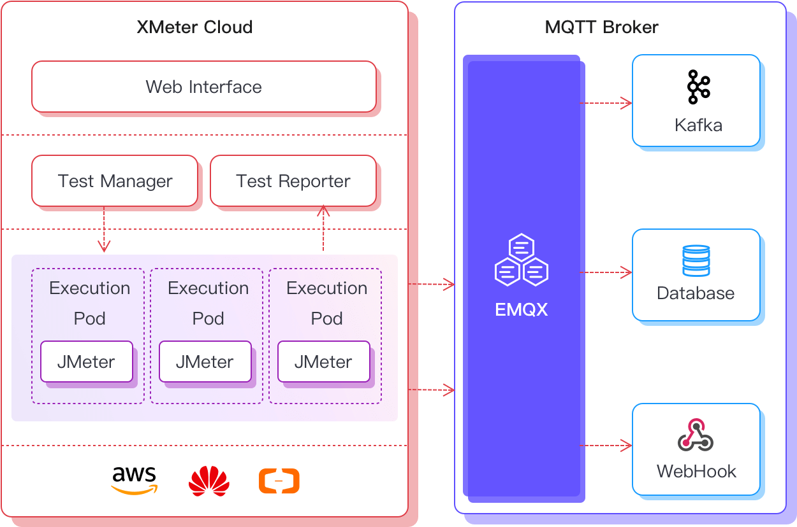

# XMeter Cloud Overview

XMeter Cloud is a large-scale public cloud testing service for the IoT domain from EMQ. Based on the open-source Apache JMeter project, XMeter Cloud supports millions of simulated device connections and message throughput testing.

## Product Advantages

### Various protocols support

Support IoT protocols like MQTT, CoAP, LwM2M, and 20 more other protocols like TCP, HTTP, HTTPS, Websocket. Extensive user-defined protocols are also supported.

### Large-scale scenarios simulation

Support testing for millions of simulated device connections and message throughput.

### Cost advantages

Charge by test resources and message traffic. Costs are clear and manageable as test resources are created and released on-demand. 

### Easy test launch without deployment

Test resources are managed by Kubernetes in a highly automated test environments. Tests can be launched easily with several steps of quick settings.

### JMeter scripts compatible

Base on the open-source Apache JMeter project and inherit JMeter's flexibility on constructing complex test scenarios.

### Visualized test report

Provide a clear graphical test report, system resource monitoring report and detailed test log analysis, which is traceable at  any time.

## Product Plans

XMeter Cloud is available in two plans: Standard and Professional. Each plan provides different scales of performance testing support.

1. Standard: Get started with XMeter Cloud easily. Small-scale MQTT testing is supported.
2. Professional: For large-scale professional performance testing. A wide range of protocols and test scenarios are supported, along with advanced features like user-defined JMeter scripts, VPC peering, etc.

### Price Details

<table>
   <tr>
      <th>Plan</th>
      <th>Specification</th>
      <th>Base Fee</th>
      <th>Traffic Fee</th>
   </tr>
   <tr>
      <td>Standard</td>
      <td>Up to 1,000 connections / Up to 1,000 TPS</td>
      <td>$4.90/min. Free coupon on first trial</td>
      <td>Included</td>
   </tr>
   <tr>
      <td>Professional</td>
      <td>Unlimited</td>
      <td colspan="2" align="center">Contact sales</td>
   </tr>
</table>

### Feature Details

<table>
  <tr>
      <th></th>
      <th>Standard</th>
      <th>Professional</th>
    </tr>
   <tr>
      <td>MQTT protocol</td>
      <td>&#10003</td>
      <td>&#10003</td>
   </tr>
   <tr>
      <td>CoAP protocol</td>
      <td>&#10007</td>
      <td>&#10003</td>
   </tr>
   <tr>
      <td>LwM2M protocol</td>
      <td>&#10007</td>
      <td>&#10003</td>
   </tr>
   <tr>
      <td>TCP protocol</td>
      <td>&#10007</td>
      <td>&#10003</td>
   </tr>
   <tr>
      <td>HTTP, HTTPS protocols</td>
      <td>&#10007</td>
      <td>&#10003</td>
   </tr>
   <tr>
      <td>Websocket protocol</td>
      <td>&#10007</td>
      <td>&#10003</td>
   </tr>
   <tr>
      <td>Extensive user-defined protocols</td>
      <td>&#10007</td>
      <td>&#10003</td>
   </tr>
   <tr>
      <td>MQTT standard test scenarios</td>
      <td>&#10003</td>
      <td>&#10003</td>
   </tr>
   <tr>
      <td>User-defined JMeter scripts</td>
      <td>&#10007</td>
      <td>&#10003</td>
   </tr>
   <tr>
      <td>Public network support</td>
      <td>&#10003</td>
      <td>&#10003</td>
   </tr>
   <tr>
      <td>VPC support</td>
      <td>&#10007</td>
      <td>&#10003</td>
   </tr>
   <tr>
      <td>Maximum number of connections</td>
      <td>1,000</td>
      <td>Unlimited</td>
   </tr>
   <tr>
      <td>Maximum TPS</td>
      <td>1,000</td>
      <td>Unlimited</td>
   </tr>
   <tr>
      <td>Client support</td>
      <td>8/5</td>
      <td>24/7</td>
   </tr>
</table>