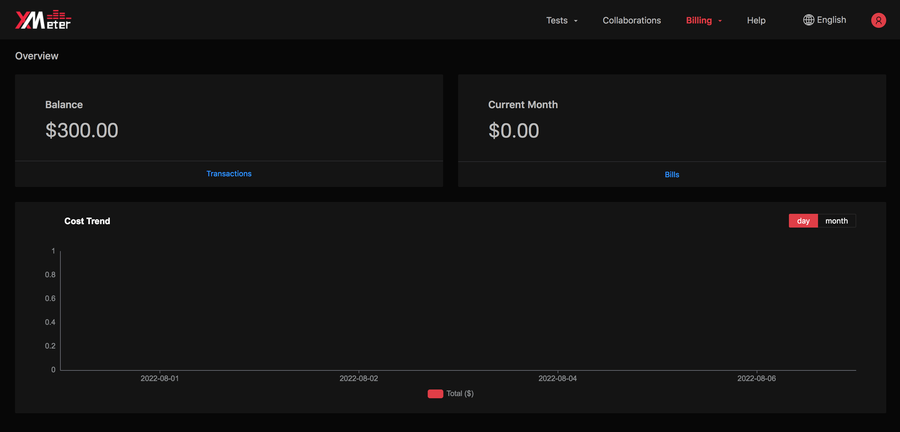
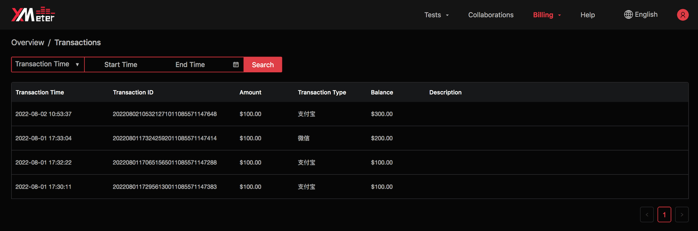
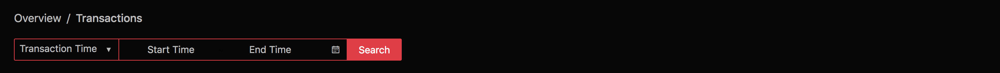
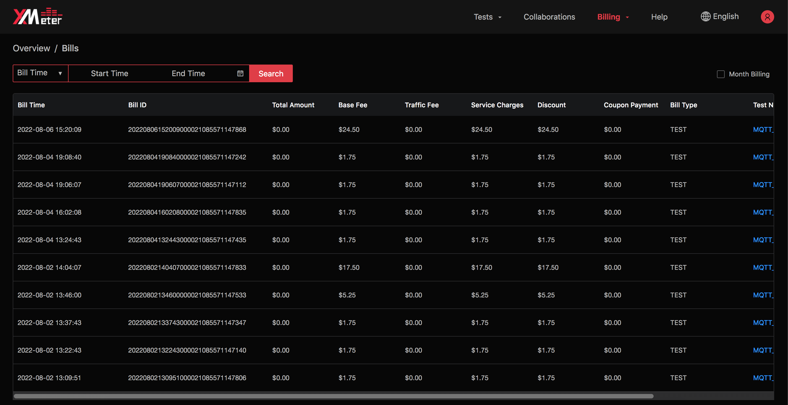
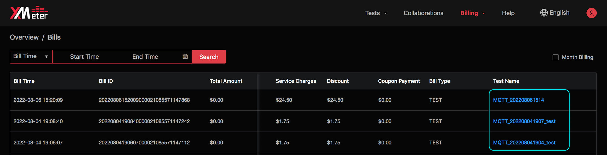
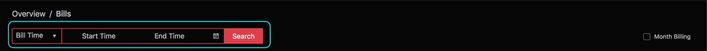
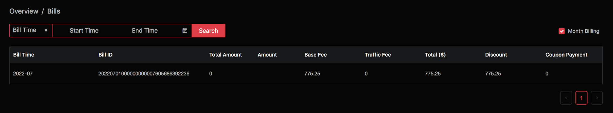

# Billing Overview

The billing overview will introduce you to the recharge of the account, view of transaction records, bills, and expense reports. Click  `Billing` -> `Overview` from the top menu to enter the billing overview page.

The overview page displays the following:

1. Balance
2. Billing of the current month (the billing from the 1st of the month to the current time)
3. Cost trend, which can be switched between  `day` and `month`  to show the corresponding cost trend

## View Transactions

The transactions will display transaction history. Access the Transactions page from the overview page.

The transaction records can be filtered by transaction time.

## View Bills

The bills will display billing records. 

1. Click  `Bills`  to view bills history

   

2. To view the details of associated test, click on the test name.

   

3. The bill records can be filtered by billing time.

   

4. Check  `Monthly bill` for monthly billing records.

   
