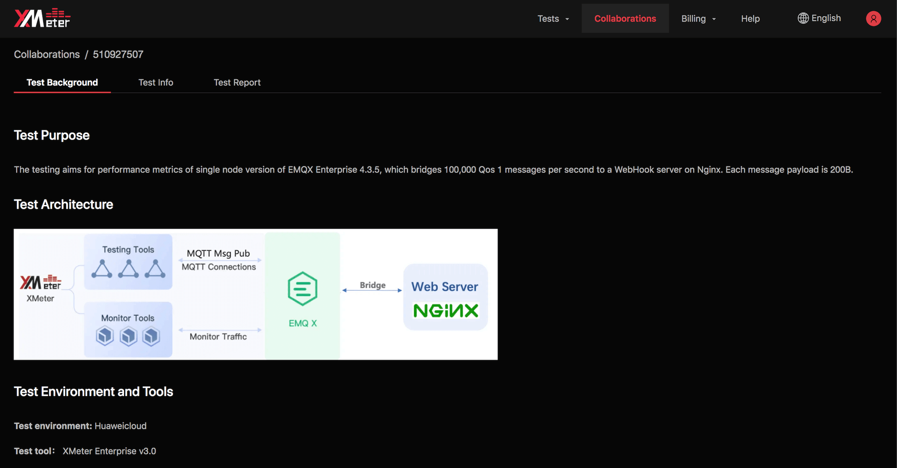

# Collaboration Reports

Collaboration reports will display XMeter Cloud reports generated from practical test scenarios.

You can view the reports directly. Report download will be enabled once you signing into XMeter Cloud. Click ` copy link ` to share the collaboration reports.

## View collaboration reports

The collaboration reports page displays the following: test background, test info and test report charts. Test info and test report charts can be referred from [Test reports](../features/test_reports.md).

### Test background

Test background will show test purpose, test scenarios, test environment, test result, etc.

