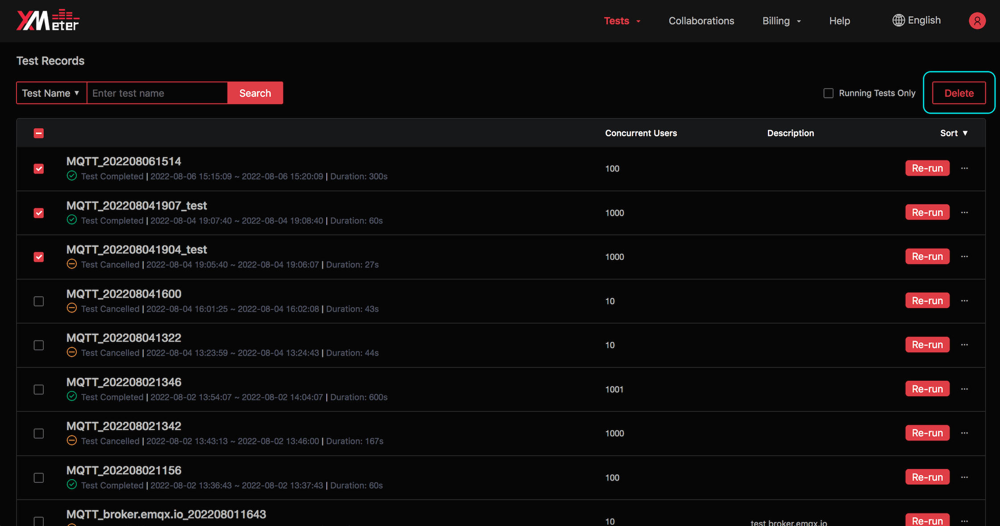

# Test Records

Test records will show records of launched tests.

1. Click `Test records` from test center page, or click  `Tests` -> Test Records` from the top menu to enter the test records page.

   

2. Filter the test records by test name and 'Show Only Running Tests' option.

3. Order the test records by test start time or end time.

4. Click test name to view test status and charts in test report page.

5. You can click  `Stop test` button to stop a running test.

6. You can click  `Re-run` button to execute the completed test again, using the same test settings.

7. Click  `...`  button to reveal more operations. You can click  `Share test report` button to enable sharing, so other users can view your test report by copied url link directly. You can also click  `Unshare test report` button to stop sharing.

8. You can click  `Delete test records` button to batch delete selected test records.

