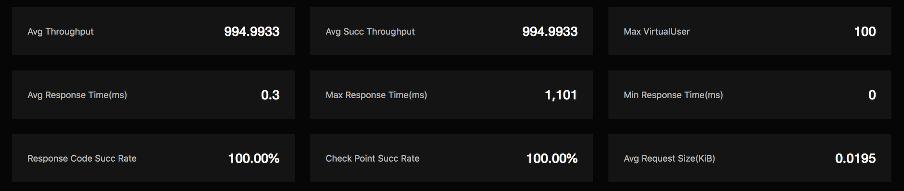

# Test Reports

Test reports will show detailed test data and test information to help you understand how your system performs under varying workload conditions. It will automatically jump to test reports page when a test is launched so you can view it online. You can also export the test report when the test is done. 

The test reports page displays the following:

## Test info

Test info will show test config and execution info.

## Test report charts

Test report charts will show detailed performance data in a visualized way. The performance data will change in real time as test runs. By analysing the performance data, you will have deeper understanding of your system being tested.

Let's review some core performance metrics: 

- TPS: transactions per second. For example, TPS in MQTT connection test means number of connections created per second; TPS in MQTT message throughput test means number of messages published and subscribed per second.
- Response time: the elapsed time takes from a transactions starts until a response is received.  
- 90% average response time: average of the first 90% of all response time. 90% average response time helps eliminate possible impact of some fluctuating data.
- Virtual user: each virtual user represents a simulated client. For example, virtual user in MQTT connection test means the connections created; virtual user in MQTT message throughput test means publishers or subscribers.
- Response code success rate: successful transactions rate. For example, in MQTT connection test it means successfully created connections rate in all connection attemps.
- Verification point success rate: success rate if extra assertions are taken for each transaction. In built-in MQTT standard test scenarios, Verification point success rate equals to response code success rate.
- Deviation: smaller deviation value means more stable system being tested.

The upper part of the test report charts shows the overall performance data based on all transactions of the test.

The line charts in middle part of the test report shows the performance trends for each transaction over time. The metrics include: response time, TPS, virtual user, success rate, network download traffic, etc.

The `Detailed data` in lower part of the test report charts shows the performance statistics for each transaction. The metrics include: hit number, average response time, 90% average response time, average TPS, success rate, deviation, etc.

## Test machine status

When a test is in execution, the test resources will be created automatically. You can look into CPU load, CPU usage, memory usage and so on to help estimate if the test is on the right track.

## Test logs

Test logs will show sorted logs generated during test. You can view logs during test runs and after test completion.

### Trace logs

Trace logs display interaction messages between simulated clients and system being tested. You can check details of a trace log record for debugging purpose.

### Error logs

Error logs display different types of errors and occurrences during test runs。 You can click and check details of an error log record.

### Other logs

Other logs display execution logs generated during test. You can also download all logs, including error logs and trace logs. 

