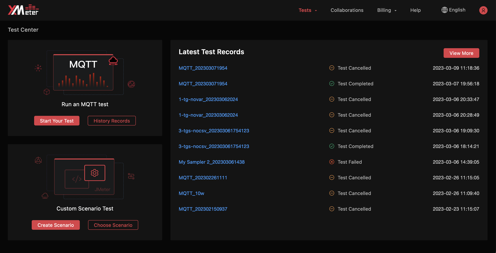
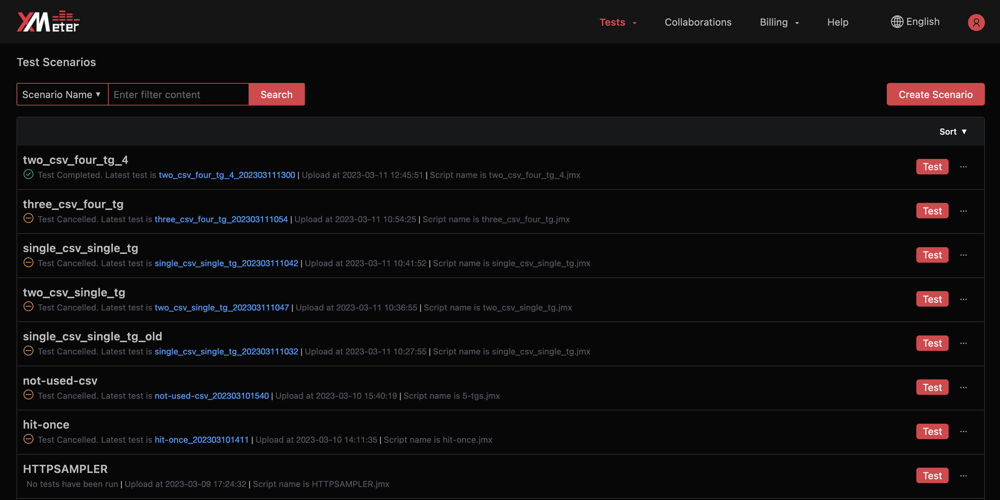
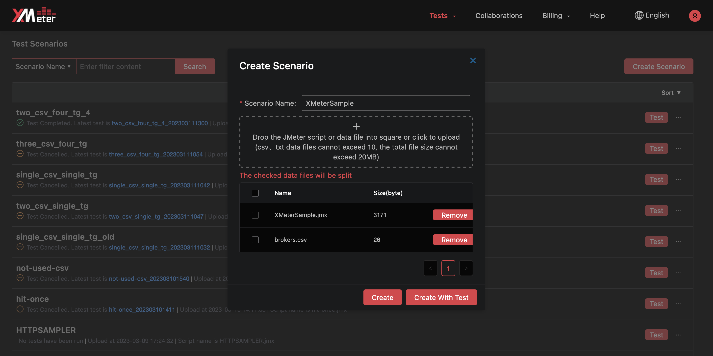
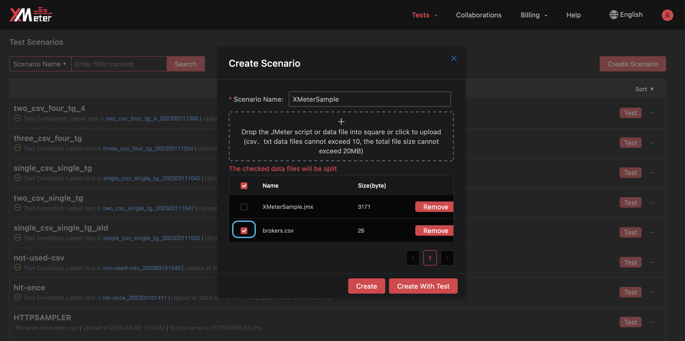
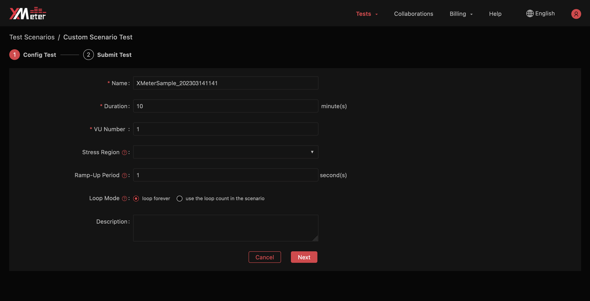
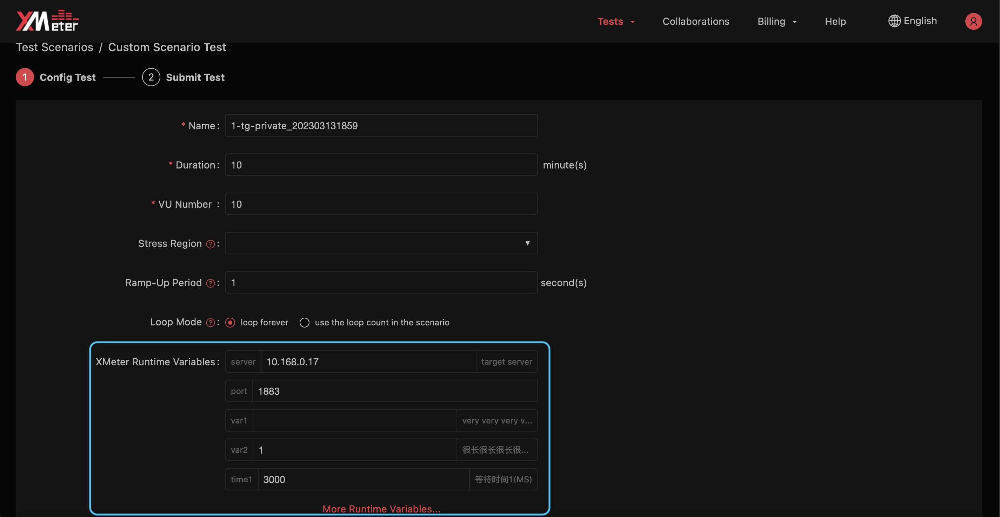
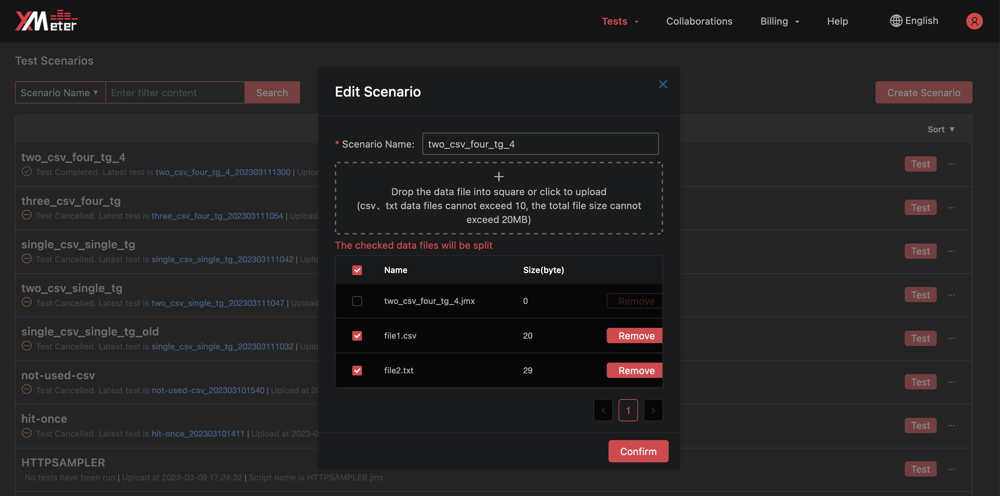
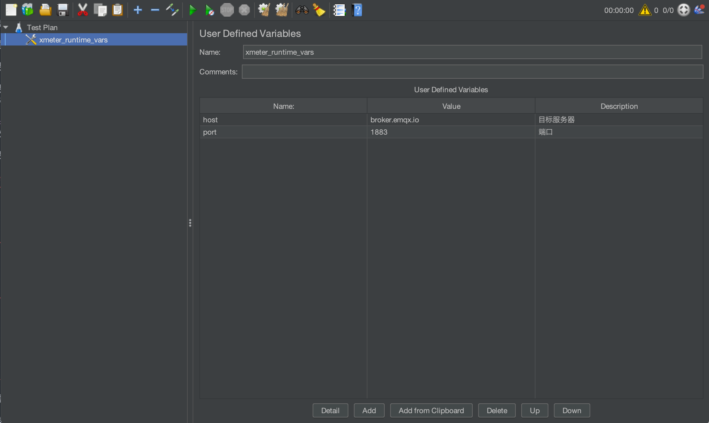

# Test scenarios

::: warning
Only available in professional plan
:::

Test scenarios will allow you to view detailed test scenario information, create custom scenarios, submit custom scenario tests, edit custom scenarios, delete custom scenarios, and download scenario scripts.

1. Click the ` Choose scenario ` button from ` Custom scenario test ` on test center page, or click `Tests` ->  `Test Scenarios`  from the top menu to enter the test scenarios page.

   

2. Filter the custom scenarios by scenario name.

3. Order the custom scenarios by scenario name or upload time.

4. You can view test status and test name from the latest test execution. You can also view upload time and script name for each custom scenario. Click the test name for the latest execution to view test charts in the test report page.

   

## Create a scenario

1. Click the ` Create scenario ` button on test scenarios page.

2. Pick up a JMeter script with .jmx extension, drag and drop it to upload. Each scenario contains 1 JMeter script, which should be compatible with JMeter 5.0 or higher versions. The script should use JMeter embedded samplers, like HTTP request sampler, TCP sampler, JDBC sampler, etc., or use samplers defined in XMeter open-source [MQTT plugin](https://github.com/emqx/mqtt-jmeter). If you want to use other JMeter third-party extension plugins, please contact us.

   

3. If you use ` CSV data set config `  in the script , upload the csv data files with .csv or .txt extensions in sequence. Please locate the csv data files in the same directory level with the script, and not include path in the ` Filename ` of ` CSV data set config `. Each scenario can contain at most 10 csv data files, with a mamixum size of 20MB.

4. XMeter Cloud will launch one or more test agents to simulate desired load. By default, all csv data files will be dispatched entirely to each agent. If you need to ensure that data is not resued on different agents, please use the data file splitting feature.

   Here is an example: the MQTT Client ID is stored in the csv data file. If the same Client ID trys to connect to the MQTT Broker more than once from different test agents, the connection requests will be rejected. With the data file splitting feature enabled, XMeter Cloud will split the data file according to the load on each agent, and dispatch the splitted data to the corresponding agents. Therefore, different test agents use different test data to ensure correct business behavior. Refer to  <a href="#data-file-splitting">Data file splitting</a> for details.

   

5. Use default scenario name, or input name you want.

6. Click the ` Create `  button, or click the ` Create with test `  button to go and config test settings after scenario is created.

## Submit a custom scenario test

1. Click the ` Test `  button for the custom scenario.

   

2. Use default test name, or input name you want.

3. Input test duration in minutes.

4. Config VU number, to specify the number of simulated concurrent users. The default VU number equals to the one in the JMeter script. If the script has only 1 thread group, please config VU number for that thread group; If the script has more than 1 thread group, VU number represents the total number of all thread groups, please click and config VU for each thread group separately. VU number for each thread group should be positive integer.

5. The regions which are bound to your peering connections display in the dropdown list. If you want to test against services or applications in VPC, please specify the corresponding region.

6. Ramp-Up period specifies how long it takes to reach the maximum number of VU. The default value is 1 second.

7. Provide description if extra test information needs to be recorded.

8. If you want to use different variable values for different test executions, please use the runtime variable feature. For example, you will execute tests for both integration testing environment and quasi-production environment, with similar scripts that only differ in target hosts and ports. If you maintain two different scenarios, there will be extra efforts. By using runtime variable feature, it will be much easier to achieve the goal.

   To enable runtime variable feature, a special ` User defined variables ` element is required in the JMeter script (Refer to <a href="#runtime-variable-configuration-in-jmeter">Runtime variable configure</a> for instructions). The runtime variables will be displayed and set value on test config page, without need to modify JMeter script over and over again.

   

9. Confirm the estimated price and test settings, then click the ` Test it now `  button to launch the test.

## Edit a custom scenario

1. Click the ` ... ` button to reveal more operations. You can click ` Edit scenario ` button modify the custom scenario.

2. You can edit scenario name, csv data files and enable/disable data file split.

   

## Delete a custom scenario

1. Click the ` ... ` button to reveal more operations. You can click ` Delete scenario ` button delete the custom scenario.

2. All test records of the custom scenario will be deleted in cascades. Please be careful.

## Data file splitting

If you check the box in front of a csv data file, the data file splitting is enabled. XMeter Cloud will split those data files and dispatch them to each test agent during execution. Therefore, each agent will use different test data.

The actual rows of data used in a splitted csv data file equals to the VU number of the thread group that contains the data file. If the data file does not contain enough rows of data, the test will fail. On the other hand, if the data file contains more data than VU numbers, the excess rows will not be used.

Here is an example: there is 1 thread group in the JMeter script, which uses a csv data file data.csv of 20,000 rows of data. The data file splitting is enabled for data.csv. During a test execution, 10,000 VU number is configured and all the simulated users are distributed to 5 test agents (e.g. 2,000 simulated users each). As a result, each agent uses different rows of data as:

| Test agent       | Rows of data used by the agent |
| ------------- | ------------------------- |
| agent 1 | 1st row to 2,000th row |
| agent 2 | 2,001st row to 4,000th row |
| agent 3 | 4,001st row to 6,000th row |
| agent 4 | 6,001st row to 8,000th row |
| agent 5 | 8,001st row to 10,000th row |

The data from 10,001st row to 20,000th row will not be used in this execution.

## Runtime variable configuration in JMeter

To enable XMeter Cloud runtime variable feature, you need extra configuration for the JMeter script used in a custom scenario.

Open the script in JMeter, create a special ` User defined variables ` named 'xmeter_runtime_vars under' the ` Test plan ` element. Then add in the variables whose values varies in different executions. For example, 2 variables 'host' and 'port' are added in xmeter_runtime_vars.

Please note, at most 1 ` User defined variables ` element named 'xmeter_runtime_vars' is permitted in a JMeter script, while the amount of variables in the element is not limited.