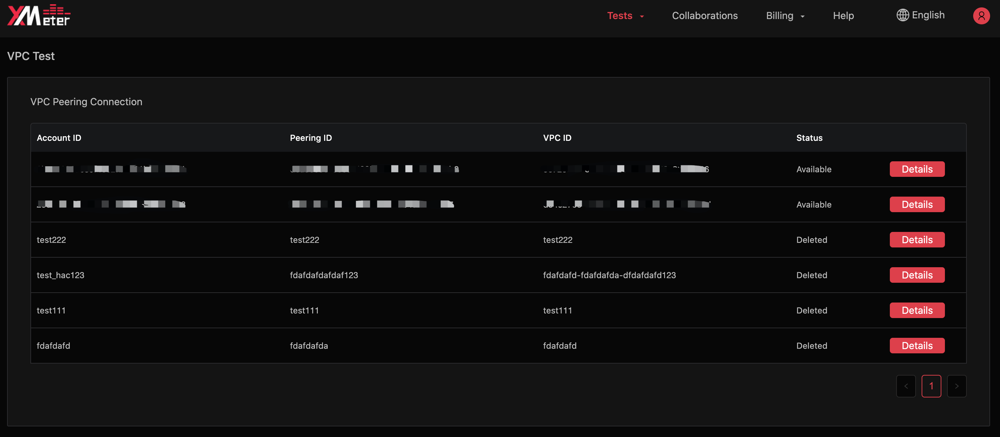
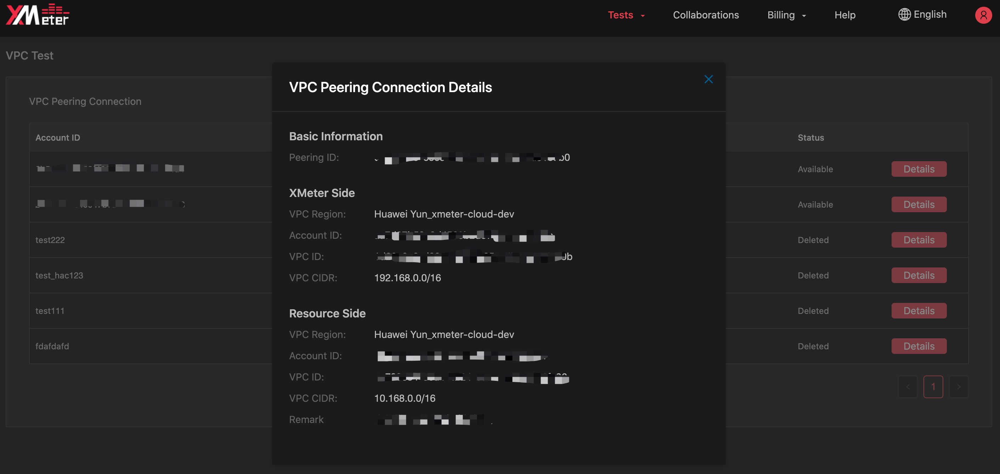
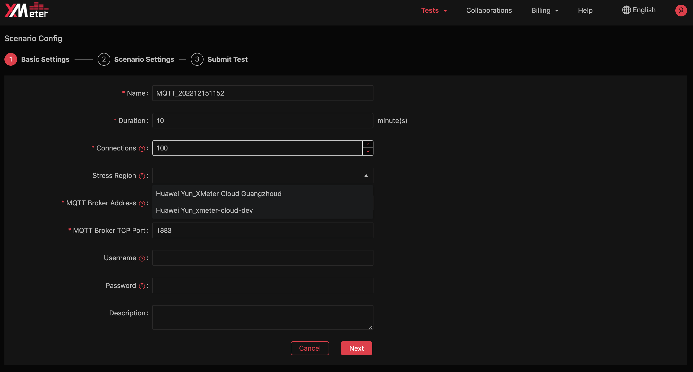
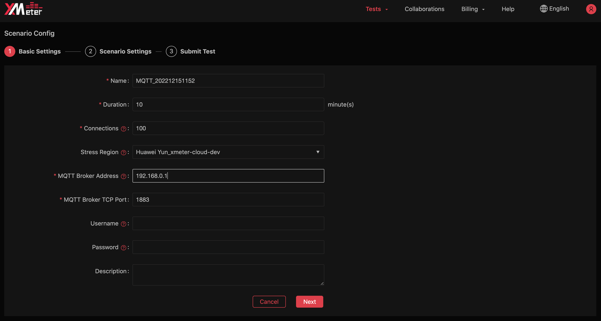
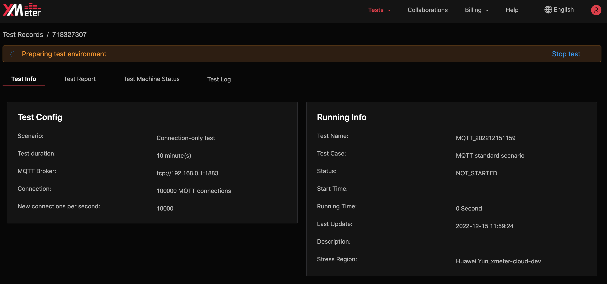

# VPC Peering Connections

::: warning
Only available in professional plan
:::

VPC peering connection is a network connection between two VPCs. Through this connection, the instances in peer VPCs can communicate with each other as if they are in the same network.

## Precautions

1. XMeter Cloud only supports creating peering connection at **the same region**.
2. Peering connections are bound to MQTT services/applications. Please contact us to assist you on creating peering connections.
3. XMeter Cloud supports Huaweicloud peering connections for now. Please contact us if you need to test MQTT services/applications on other cloud platforms.

## View peering connections

1. Click `Tests` ->  `VPC Test`  from the top menu the enter the VPC info page. 

2. Click `Details` to view the detail info of the peerings.

   

3. In VPC Peering Connection Details dialog,  `XMeter Side` displays info of the VPC used by XMeter Cloud, while `Resource Side` displays info of the VPC where the MQTT broker to be tested resides in. Currently, you can set at most one VPC peering connection in each supported region, and test against MQTT brokers bound to the corresponding peering connection via private IP.

   

## Test using private IP

1. In the Basic Settings of Scenario Config, the regions which are bound to your peering connections display in the dropdown list.

   

2. When the region has been chosen, you can input the private IP of the MQTT broker to be tested. The broker should be in the VPC that is bound to the corresponding peering connection and can be connected from XMeter Cloud.

   

3. After the test is submitted, you can view the region in which the test is running from `Test Info` tab. 

   
   