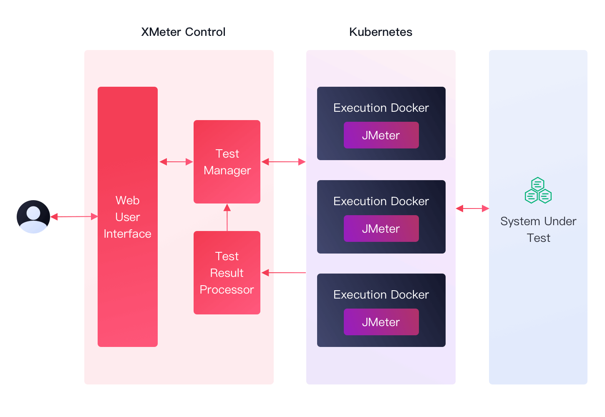

# XMeter Cloud Product Overview

XMeter Cloud is a large-scale public cloud testing service for the IoT domain from EMQ. Based on the open-source Apache JMeter project, XMeter Cloud supports millions of simulated device connections and message throughput testing.

