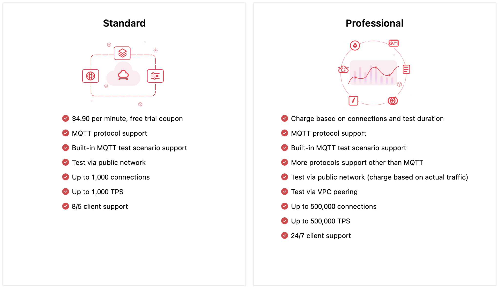

# Product Plans

XMeter Cloud is available in two plans: Standard and Professional. Each plan provides different scales of performance testing support.

1. Standard: Get started with XMeter Cloud easily. Small-scale MQTT testing is supported. The Standard plan offers a 14-day free trial.
2. Professional: For large-scale professional performance testing. A wide range of protocols and test scenarios are supported, along with advanced features like user-defined JMeter scripts, VPC peering, etc.

## Price Details

<table>
   <tr>
      <th>Plan</th>
      <th>Specification</th>
      <th>Base Fee</th>
      <th>Traffic Fee</th>
   </tr>
   <tr>
      <td>Standard</td>
      <td>Up to 1,000 connections / Up to 1,000 TPS</td>
      <td>$0.35/min. 14-day free trial</td>
      <td>Included</td>
   </tr>
   <tr>
      <td>Professional</td>
      <td>Unlimited</td>
      <td colspan="2" align="center">Contact sales</td>
   </tr>
</table>

## Feature Details

<table>
  <tr>
      <th></th>
      <th>Standard</th>
      <th>Professional</th>
    </tr>
   <tr>
      <td>MQTT protocol</td>
      <td>&#10003</td>
      <td>&#10003</td>
   </tr>
   <tr>
      <td>CoAP protocol</td>
      <td>&#10007</td>
      <td>&#10003</td>
   </tr>
   <tr>
      <td>LwM2M protocol</td>
      <td>&#10007</td>
      <td>&#10003</td>
   </tr>
   <tr>
      <td>TCP protocol</td>
      <td>&#10007</td>
      <td>&#10003</td>
   </tr>
   <tr>
      <td>HTTP, HTTPS protocols</td>
      <td>&#10007</td>
      <td>&#10003</td>
   </tr>
   <tr>
      <td>Websocket protocol</td>
      <td>&#10007</td>
      <td>&#10003</td>
   </tr>
   <tr>
      <td>Extensive user-defined protocols</td>
      <td>&#10007</td>
      <td>&#10003</td>
   </tr>
   <tr>
      <td>MQTT standard test scenarios</td>
      <td>&#10003</td>
      <td>&#10003</td>
   </tr>
   <tr>
      <td>User-defined JMeter scripts</td>
      <td>&#10007</td>
      <td>&#10003</td>
   </tr>
   <tr>
      <td>Public network support</td>
      <td>&#10003</td>
      <td>&#10003</td>
   </tr>
   <tr>
      <td>VPC support</td>
      <td>&#10007</td>
      <td>&#10003</td>
   </tr>
   <tr>
      <td>Maximum number of connections</td>
      <td>1,000</td>
      <td>Unlimited</td>
   </tr>
   <tr>
      <td>Maximum TPS</td>
      <td>1,000</td>
      <td>Unlimited</td>
   </tr>
   <tr>
      <td>Client support</td>
      <td>8/5</td>
      <td>24/7</td>
   </tr>
</table>