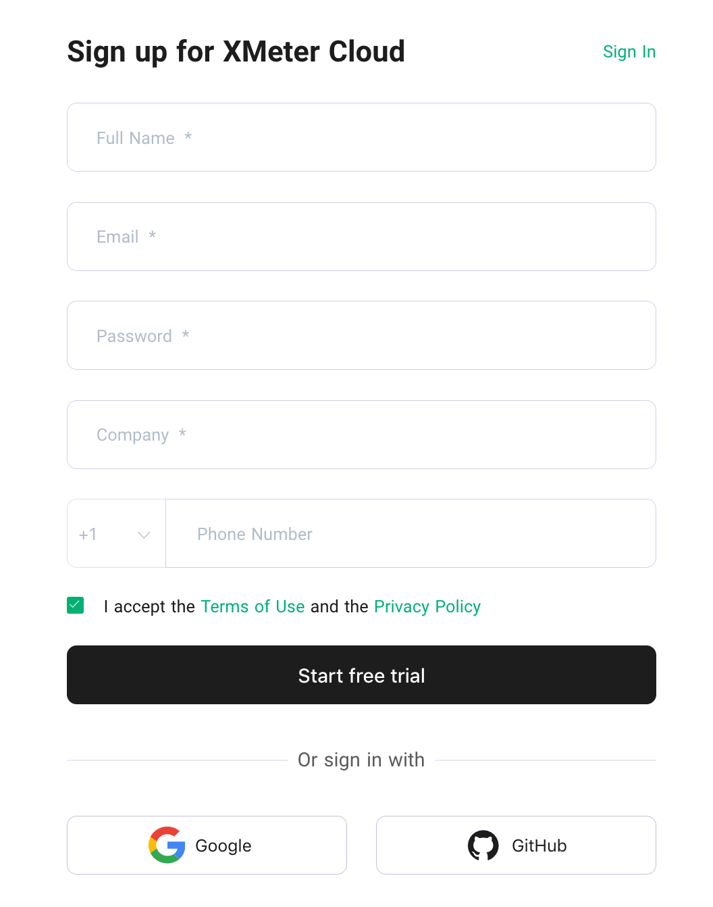

# Register Guide

## [Register an account](https://www.emqx.com/zh/signup?continue=https://www.emqx.com/zh/products/xmeter)

Start and the XMeter Cloud sign up page

1. Enter your personal information: 

   - Name
   - Email
   - Password
   - Company

   

2. Click `Sign up` to register to create your account. XMeter Cloud will automatically send a confirmation email to the email address you provided.

3. Click on the link in the confirmation email to verify your new account. The link will verify you account and redirect you to the login page.

4. Now you are ready to log in to XMeter Cloud.

## [Login to the account](https://www.emqx.com/zh/signin?continue=https://www.emqx.com/cn/cloud)

1. Go to XMeter Cloud login page.
2. Enter your email and password.
3. Click `Sign in` to direct to the XMeter Cloud page. 

