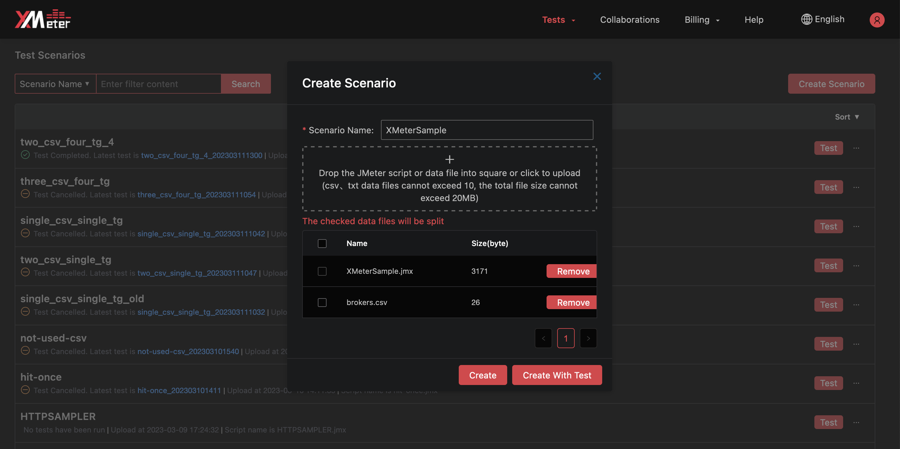

# Submit a custom scenario test

XMeter Cloud is based on open-source [Apache JMeter](https://jmeter.apache.org/) project, fully compatible with JMeter scripts. If you are using XMeter Cloud professional plan, you can create a custom scenario with JMeter script, and launch a test from the custom scenario. This enables load tests not limited to MQTT. Tests for protocols like TCP, HTTP/HTTPS, WebSocket can  also be supported.

This tutorial will guide you through the process of submitting a test for protocols other than MQTT in XMeter Cloud.

## Create a custom scenario and submit a test

1. Use JMeter to create a script for the test scenario you need. XMeter Cloud is compatible with JMeter scripts created in JMeter 5.0 and higher versions. If you use ` CSV data set config ` in your JMeter script, please locate the csv data files in the same directory level with the script, and not include path in the ` Filename ` of ` CSV data set config `

   

2. Login to [XMeter Cloud Console](https://xmeter-cloud.emqx.com/commercialPage.html#/).

3. Click the ` Create Scenario ` button.

   

4. Upload JMeter script (with .jmx extension) , and provide scenario name.

   

5. If the JMeter script uses ` CSV data set config `, upload the csv data files (with .csv or .txt extension).

6. Click the ` Create with Test ` button, create the custom scenario and go to test setting.

   

   - Provide the following information:
     - Test name
     - Test duration
     - VU number. It presents the number of simulated concurrent users. If more than 1 thread groups are included in the script, you will click and config VU for each thread group.
     - Ramp-Up period. It specifies how long to reach the maximum number of VU.

7. Click the ` Next ` button, review the estimated price and test settings.

   

8. Click  the ` Test it now ` button, you will automatically jump to the test report page. You can view the test status and charts when the testing is running, as well as exporting test report when the test is done. Refer to  [Test reports](../features/test_reports.md) for more guide of understanding a test report. 