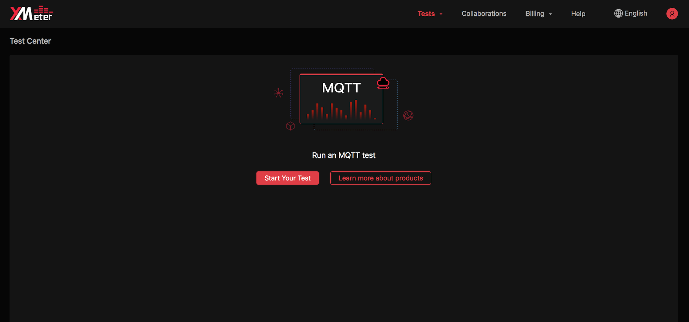
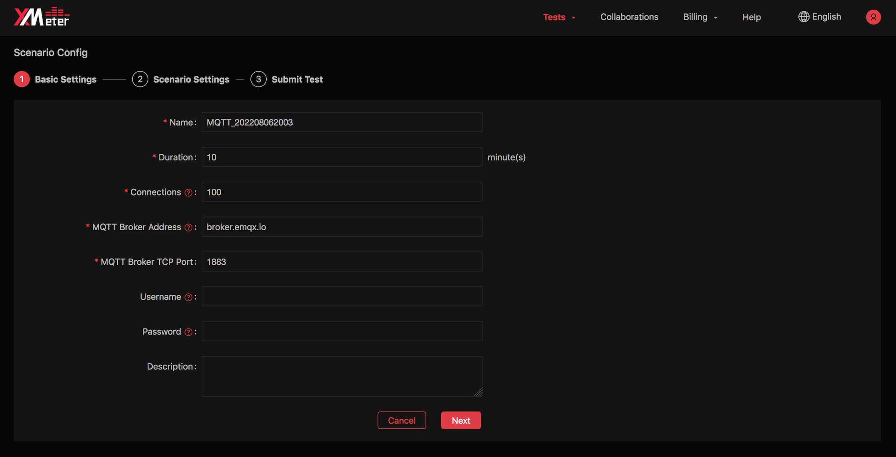
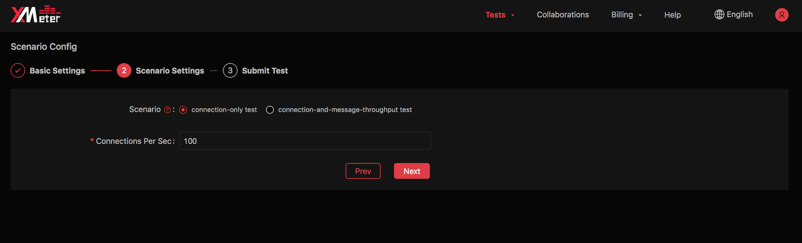
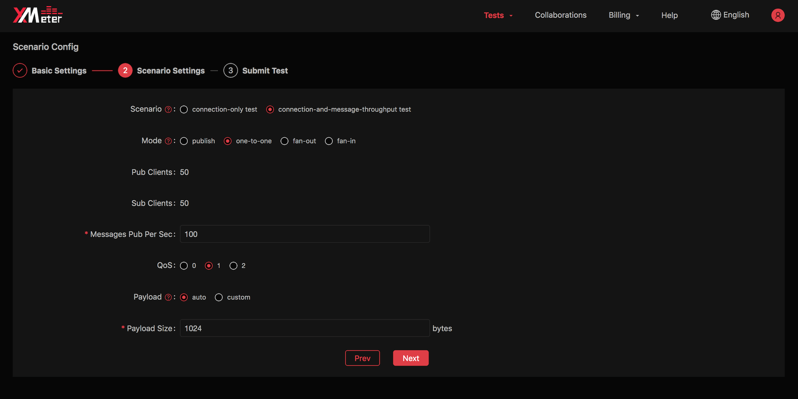
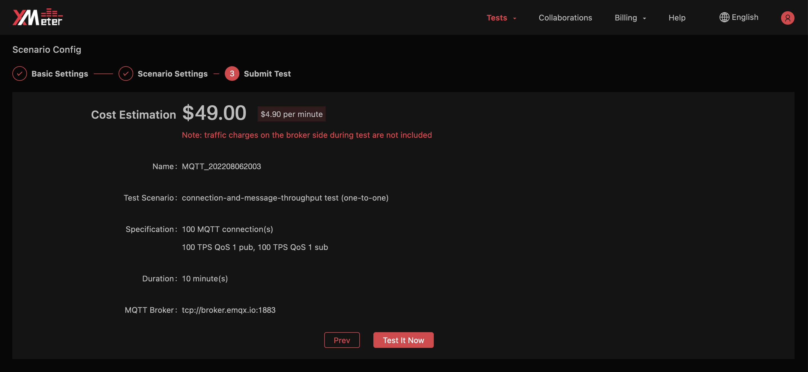

# Submit an MQTT test

MQTT protocol is one of the core IoT messaging protocols. This tutorial will guide you through the process of submitting an MQTT test using the built-in MQTT test scenarios in XMeter Cloud. 

## Start an MQTT standard scenario test

1. Login to [XMeter Cloud Console](https://xmeter-cloud.emqx.com/commercialPage.html#/).

2. Click the ` Start test ` button.

   

3. Go through the basic settings.

   

   - Provide the following information:
     - Test name
     - Test duration
     - Connections to MQTT Broker. For message throughput testing, connections to MQTT Broker from both publishers and subscribers are counted in.
     - MQTT Broker public ip/host and TCP port. If you test again MQTT on EMQX Cloud, obtain the deployment host and port from EMQX Cloud deployment page.
     - User name and password are only needed when your MQTT Broker enables authentication. If you test again MQTT on EMQX Cloud, obtain the information from EMQX Cloud authentication page.
     - Description for optional test details.

4. Go through the scenario settings.

   If you select 'Connection-only test', you will input for 'New connections per second'.

   

   If you select 'Connection-and-message-throughput test', you will provide more information for publisher and subscriber according to selected messaging mode :

   - Select mode:
      - Publish mode: multiple publishers send messages to single topic (if you input the desired one) or multiple topics
      - One-to-one mode: each publisher sends messages received by a corresponding subscriber
      - Fan-out mode: single publisher sends messages to multiple subscribers on the same topic
      - Fan-in mode: multiple publishers send messages received by a few subscribers on a shared subscription basis

   

   - Input number of publishers/subscribers for some messaging modes：
      - Publish mode: no subscriber and equal number of publishers as connections set in previous step. No manual setting required.
      - One-to-one mode: both publishers and subscribers take half the number of connections set in previous step. No manual setting required.
      - Fan-out mode: fixed 1 publisher and equal number of subscribers as connections set in previous step. No manual setting required.
      - Fan-in mode: equal number of publishers as connections set in previous step, and subscribers should be less than publishers. You will input the number of subscribers.
   - Input messages published per second: in fan-out mode, message throughput is fixed at 1 per second for each publisher (in professional plan, you can also customize this value). In other mode, you will input the tps based on your demand.
   - Select QoS.
   - Input payload: you can specify message content by manual input, or using auto-generate strings of a given length.  

5. Review the estimated price and test settings.

   

6. Click  the ` Test it now ` button, you will automatically jump to the test report page. You can view the test status and charts when the testing is running, as well as exporting test report when the test is done. Refer to  [Test reports](../features/test_reports.md) for more guide of understanding a test report. 