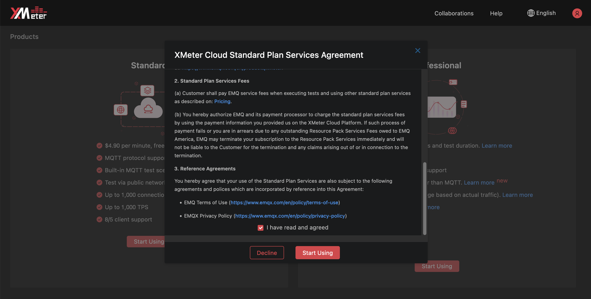

# Choose a product plan

On your first time using XMeter Cloud, you will choose either the standard plan or professional plan to use.

If you want to have a quick try with XMeter Cloud, and launch small-scale load tests, you can choose standard plan. It is easy to upgrade to professional plan later by yourself.

If you want to perform large-scale load tests with more advanced features, you can choose professional plan from the beginning..

## Use XMeter Cloud for the first time

1. Choose a product plan by your requirement, and click the ` Start Using ` button.

2. Go through XMeter Cloud services agreement, check the 'I have read and agreed' box, and click the ` Start Using ` button.

## Upgrade to professional plan

1. Click ` User Profile ` ->  ` Upgrade `  from the top menu to enter the Product page. Then Click the ` Upgrade to Professional plan ` button.

2. Go through XMeter Cloud services agreement, check the 'I have read and agreed' box, and click the ` Upgrade ` button.

## Professional plan features

### Larger-scale testing

Professional plan supports testing up to 500,000 connections and 500,000 TPS with payload up to 100 KB. Maximum testing duration is 24 hours.

### Other protocols support

Professional plan supports tests for protocols other than MQTT. You can create a custom scenario by constructing and uploading  JMeter script, which is fully compatible with XMeter Cloud. Protocols embedded in JMeter 5.0 or higher versions are supported, like TCP, HTTP/HTTPS, WebSocket, etc. If you are going to test for other protocols not supported by JMeter natively, please contact us.

### VPC peering

Users can set up VPC peering to test against services/applications in VPC.

