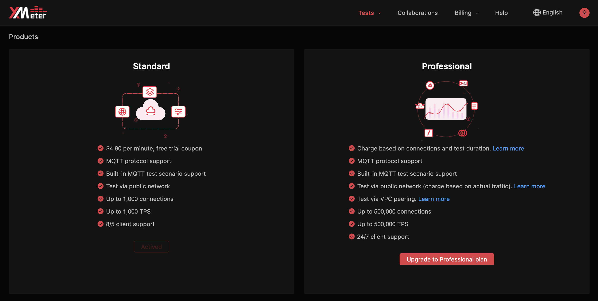

## Upgrade to professional plan

Click `User Profile` ->  `Upgrade`  from the top menu the enter the Products page. Then Click the `Upgrade to Prefessional plan` button, read and agree the XMeter Cloud Professional Plan Services Agreement, and your account will be upgraded to professional plan.

You can also contact us via the following ways to help upgrade to professional plan:

- Email: xmeter@emqx.io

## Professional plan features

### Larger-scale testing

Professional plan supports testing up to 500,000 connections and 500,000 TPS with payload up to 100 KB. Maximum testing duration is 24 hours.

### VPC peering

Users can set up VPC peering to test against services/applications in VPC.

