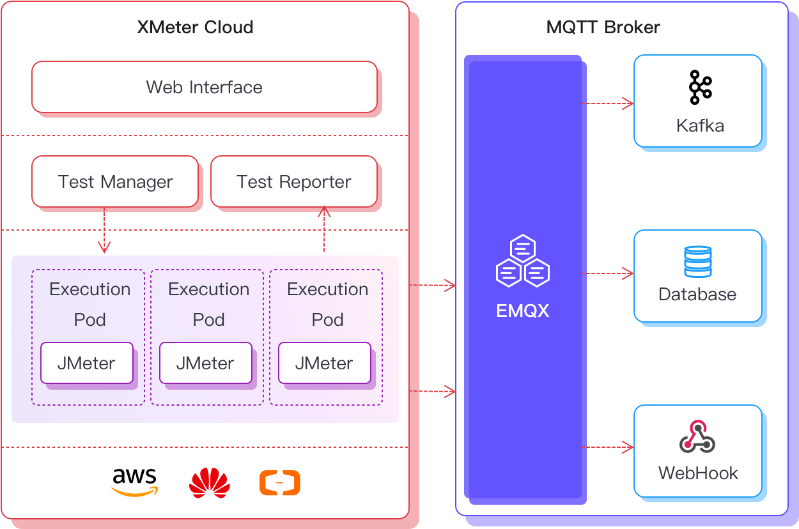

# XMeter Cloud 产品简介

XMeter Cloud 是 EMQ 公司推出的面向物联网关键业务的大规模性能测试公有云服务。XMeter 基于 Apache 开源项目 JMeter，可支持百万量级的模拟用户、设备并发连接以及消息吞吐的性能测试。

## 产品优势

### 多种协议支持

支持 MQTT、CoAP、LwM2M 等多种物联网协议，以及TCP、HTTP、HTTPS、Websocket 等 20 多项其他协议的测试。并支持自定义扩展协议的测试。

### 大规模场景模拟

可支持百万量级并发测试，测试场景可模拟大规模设备连接与消息吞吐。

### 低成本测试资源

按使用的测试机规模与消息流量收费，根据测试周期自动分配与释放测试机，成本清晰可控。

### 无需部署，轻松发起测试

测试机资源基于 Kubernetes 云原生架构部署，测试环境高度自动化，提供必要测试信息后即可运行测试，简单快捷。

### 兼容 JMeter 脚本

基于 Apache JMeter 开源项目，充分利用 JMeter 可灵活创建复杂测试场景的优势。

### 可视化测试报告

提供一目了然的图形化测试报告，详细的测试日志分析及被测系统资源监控报告，随时溯源。