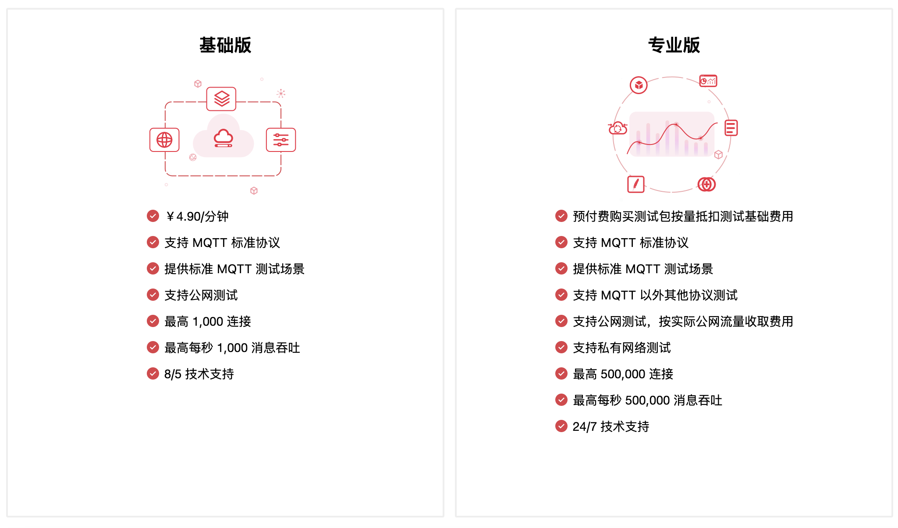

# XMeter Cloud 产品简介

XMeter Cloud 是 EMQ 公司推出的面向物联网关键业务的大规模性能测试公有云服务。XMeter 基于 Apache 开源项目 JMeter，可支持百万量级的模拟用户、设备并发连接以及消息吞吐的性能测试。

## 产品优势

### 多种协议支持

支持 MQTT、CoAP、LwM2M 等多种物联网协议，以及TCP、HTTP、HTTPS、Websocket 等 20 多项其他协议的测试。并支持自定义扩展协议的测试。

### 大规模场景模拟

可支持百万量级并发测试，测试场景可模拟大规模设备连接与消息吞吐。

### 低成本测试资源

按使用的测试机规模与消息流量收费，根据测试周期自动分配与释放测试机，成本清晰可控。

### 无需部署，轻松发起测试

测试机资源基于 Kubernetes 云原生架构部署，测试环境高度自动化，提供必要测试信息后即可运行测试，简单快捷。

### 兼容 JMeter 脚本

基于 Apache JMeter 开源项目，充分使用 JMeter 创建灵活复杂测试场景上的优势。

### 可视化测试报告

提供一目了然的图形化测试报告，详细的测试日志分析及被测系统资源监控报告，随时溯源。

## 产品版本

XMeter Cloud 分为两个版本，每个版本支持不同规格。

1. 基础版：快速体验 XMeter Cloud 测试服务，进行小规格 MQTT 性能测试。
2. 专业版：适用于大规模的专业性能测试，丰富的协议支持和测试场景支持，包含自定义脚本、私有网络连接等高级功能。

### 产品定价

<table>
   <tr>
      <th>版本</th>
      <th>规格</th>
      <th>基础费用</th>
      <th>流量费用</th>
   </tr>
   <tr>
      <td>基础版</td>
      <td>最高 1,000 连接 / 最高 1,000 TPS</td>
      <td>¥1.75/分钟。14 天内免费试用</td>
      <td>无</td>
   </tr>
   <tr>
      <td>专业版</td>
      <td>无限制</td>
      <td colspan="2" align="center">联系商务</td>
   </tr>
</table>

### 产品功能

<table>
  <tr>
      <th></th>
      <th>基础版</th>
      <th>专业版</th>
    </tr>
   <tr>
      <td>MQTT 协议支持</td>
      <td>&#10003</td>
      <td>&#10003</td>
   </tr>
   <tr>
      <td>CoAP 协议支持</td>
      <td>&#10007</td>
      <td>&#10003</td>
   </tr>
   <tr>
      <td>LwM2M 协议支持</td>
      <td>&#10007</td>
      <td>&#10003</td>
   </tr>
   <tr>
      <td>TCP 协议支持</td>
      <td>&#10007</td>
      <td>&#10003</td>
   </tr>
   <tr>
      <td>HTTP, HTTPS 协议支持</td>
      <td>&#10007</td>
      <td>&#10003</td>
   </tr>
   <tr>
      <td>Websocket 协议支持</td>
      <td>&#10007</td>
      <td>&#10003</td>
   </tr>
   <tr>
      <td>自定义协议支持</td>
      <td>&#10007</td>
      <td>&#10003</td>
   </tr>
   <tr>
      <td>MQTT 标准测试场景支持</td>
      <td>&#10003</td>
      <td>&#10003</td>
   </tr>
   <tr>
      <td>自定义 JMeter 脚本支持</td>
      <td>&#10007</td>
      <td>&#10003</td>
   </tr>
   <tr>
      <td>公网测试</td>
      <td>&#10003</td>
      <td>&#10003</td>
   </tr>
   <tr>
      <td>私有网络测试</td>
      <td>&#10007</td>
      <td>&#10003</td>
   </tr>
   <tr>
      <td>最大连接数</td>
      <td>1,000</td>
      <td>无限制</td>
   </tr>
   <tr>
      <td>最大 TPS</td>
      <td>1,000</td>
      <td>无限制</td>
   </tr>
   <tr>
      <td>客户支持</td>
      <td>8/5</td>
      <td>24/7</td>
   </tr>
</table>
