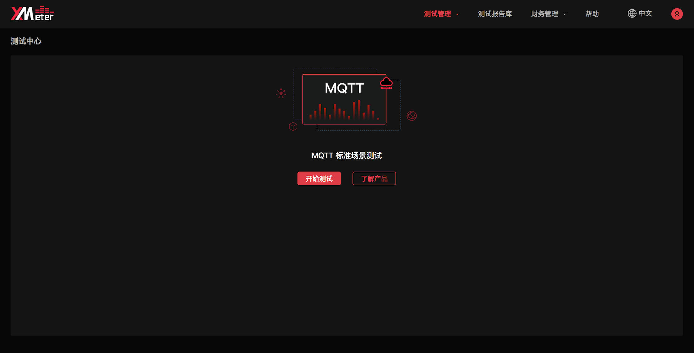
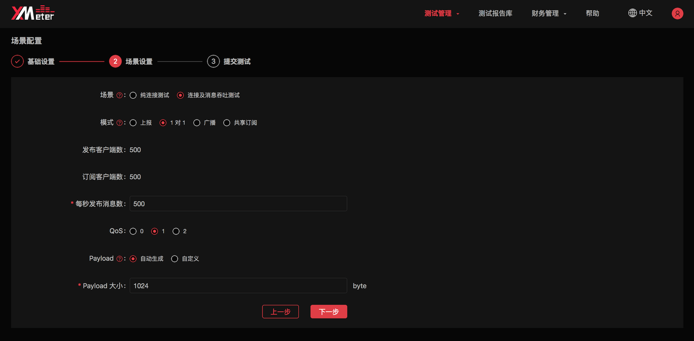
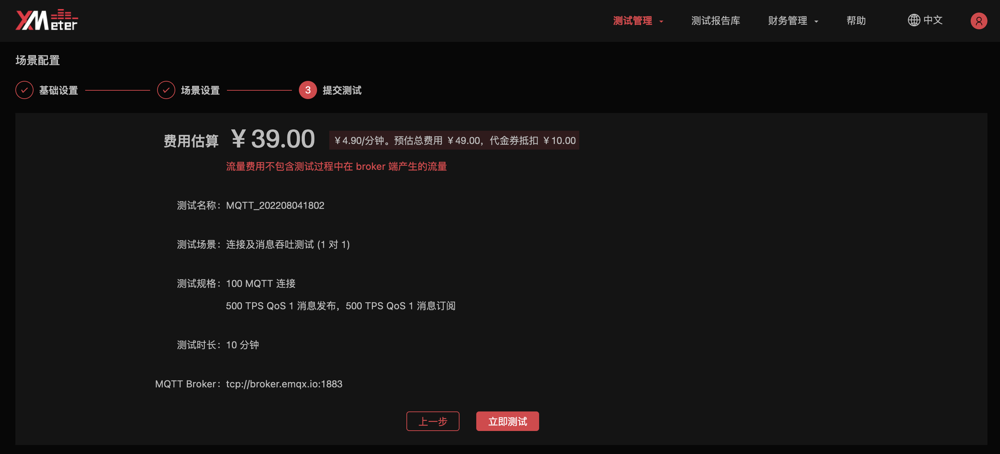
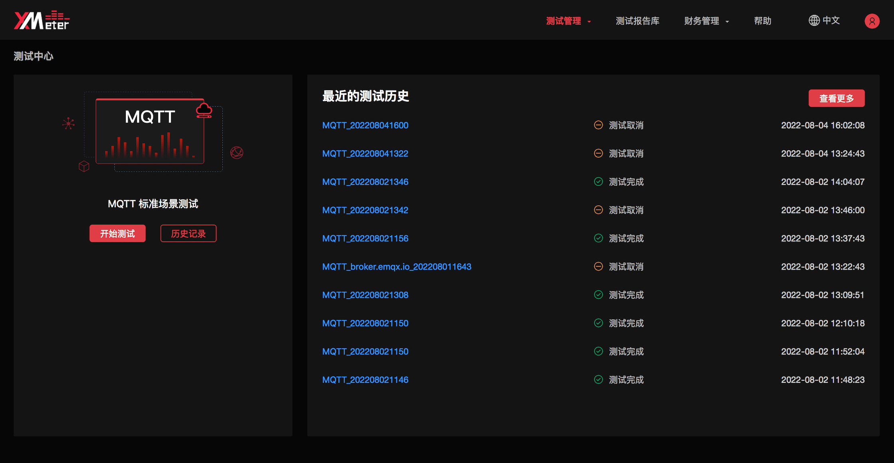
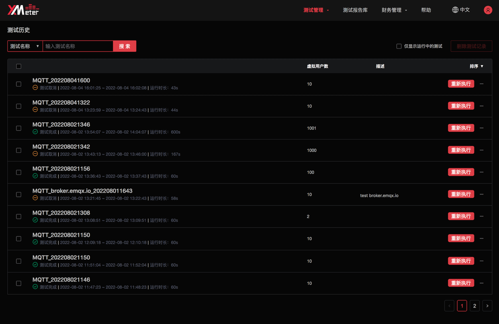

[TOC]

# XMeter Cloud 产品简介

XMeter Cloud 是 EMQ 公司推出的面向物联网关键业务的大规模性能测试公有云服务。XMeter 基于 Apache 开源项目 JMeter，可支持百万量级的模拟用户、设备并发连接以及消息吞吐的性能测试。

## 产品优势

### 多种协议支持

支持 MQTT、CoAP、LwM2M 等多种物联网协议，以及TCP、HTTP、HTTPS、Websocket 等 20 多项其他协议的测试。并支持自定义扩展协议的测试。

### 大规模场景模拟

可支持百万量级并发测试，测试场景可模拟大规模设备连接与消息吞吐。

### 低成本测试资源

按使用的测试机规模与消息流量收费，根据测试周期自动分配与释放测试机，成本清晰可控。

### 无需部署，轻松发起测试

测试机资源基于 Kubernetes 云原生架构部署，测试环境高度自动化，提供必要测试信息后即可运行测试，简单快捷。

### 兼容 JMeter 脚本

基于 Apache JMeter 开源项目，充分使用 JMeter 创建灵活复杂测试场景上的优势。

### 可视化测试报告

提供一目了然的图形化测试报告，详细的测试日志分析及被测系统资源监控报告，随时溯源。

## 产品版本

XMeter Cloud 分为两个版本，每个版本支持不同规格。

1. 基础版：快速体验 XMeter Cloud 测试服务，进行小规格 MQTT 性能测试。
2. 专业版：适用于大规模的专业性能测试，丰富的协议支持和测试场景支持，包含自定义脚本、私有网络连接等高级功能。

### 产品定价

| 版本   | 规格                             | 基础费用                           | 流量费用 |
| ------ | -------------------------------- | ---------------------------------- | -------- |
| 基础版 | 最高 1,000 连接 / 最高 1,000 TPS | ¥4.90/分钟。首次使用赠送测试代金券 | 无       |
| 专业版 | 无限制                           | 联系商务                           | 联系商务 |

### 产品功能

|                        | 基础版 | 专业版 |
| ---------------------- | ------ | ------ |
| MQTT 协议支持          | ✓      | ✓      |
| CoAP 协议支持          | ✗      | ✓      |
| LwM2M 协议支持         | ✗      | ✓      |
| TCP 协议支持           | ✗      | ✓      |
| HTTP, HTTPS 协议支持   | ✗      | ✓      |
| Websocket 协议支持     | ✗      | ✓      |
| 自定义协议支持         | ✗      | ✓      |
| MQTT 标准测试场景支持  | ✓      | ✓      |
| 自定义 JMeter 脚本支持 | ✗      | ✓      |
| 公网测试               | ✓      | ✓      |
| 私有网络测试           | ✗      | ✓      |
| 最大连接数             | 1,000  | 无限制 |
| 最大 TPS               | 1,000  | 无限制 |
| 客户支持               | 8/5    | 24/7   |

# 快速入门

欢迎使用 XMeter Cloud，XMeter Cloud 是面向物联网关键业务的性能测试公有云服务，支持大规模的 MQTT 连接与消息吞吐性能测试。本教程将指导您快速发起 MQTT 测试。

如果您还没有创建 XMeter Cloud 的账号，请先完成账号的创建和登录。

如果您已经创建了账号并准备使用 XMeter Cloud 的服务，也可以直接查看提交 MQTT 测试的快速指南。

## 创建和登录 XMeter Cloud 账户

### [注册账户](https://www.emqx.com/zh/signup?continue=https://xmeter-cloud.emqx.com/commercialPage.html#)

1. 输入您的信息：姓名，邮箱，密码，公司名称。
2. 根据监管要求，注册需要验证手机完成实名认证。
3. 点击注册，确认邮件将自动发送到您提供的邮箱地址。
4. 要验证您的新账户，请点击确认邮件中的链接，该链接将会验证您的账户，并返回登录页面。

### [登录账户](https://www.emqx.com/zh/signin?continue=https://xmeter-cloud.emqx.com/commercialPage.html#)

1. 输入您的邮箱和密码，然后选择登录，进入 XMeter Cloud。
2. 您也可以通过微信、GitHub 登录。

## 提交 MQTT 测试

MQTT 协议占据了物联网协议的半壁江山。在本教程中，您将学习如何使用 XMeter Cloud 内置的 MQTT 测试场景快速发起 MQTT 性能测试。

### 创建并发起 MQTT 标准场景测试

1. 登录账户，导航到 XMeter Cloud [控制台](https://xmeter-cloud.emqx.com/commercialPage.html#/)。

2. 在测试中心页面的 MQTT  标准场景测试处，点击 `开始测试`。

   

3. 进行基础设置

   

   - 设置测试名称：为测试设置具有辨识度的名称，以与其他测试区分。
   - 设置测试时长：测试的预期运行时间。
   - 设置连接数：测试中与 MQTT Broker 建立的连接数量。在带消息吞吐的测试场景下，连接数包括了发布客户端和订阅客户端与 MQTT Broker 的连接。
   - 设置 MQTT Broker 地址及端口：MQTT Broker 的公网 IP 或 Host，以及 TCP 的端口。选择 EMQX Cloud 作为 MQTT Broker 的用户可以从相应部署的概览页面，复制部署的连接地址及端口。

   

   - 设置用户名及密码：客户端连接 MQTT Broker 时的认证用户名和密码。如果 Broker 端未开启认证，不需要填写。选择 EMQX Cloud 作为 MQTT Broker 的用户可以从相应部署的认证鉴权页面，查看对应的用户名和密码。

   

   - 设置描述：为测试提供进一步的说明信息。

1. 进行场景设置

   如果您选择了“纯连接测试”场景，只对 MQTT Broker 进行连接测试，您需要输入每秒新建的连接数。

   

   如果您选择了“连接及消息吞吐测试”场景，将根据不同的模式对发布客户端及订阅客户端进行进一步的设置。

   - 指定模式：您可以从四种模式中选择一种：
     - 上报模式：多个发布客户端向 1 个主题发布消息
     - 1 对 1 模式：每个发布客户端发布的消息都由 1 个对应的订阅客户端接收
     - 广播模式：1 个发布客户端在同一个主题上向多个订阅客户端发布消息
     - 共享订阅模式：多个发布客户端发布消息，少数订阅客户端以共享订阅方式接收

   

   - 设置发布客户端与订阅客户端数量。每种不同的模式对应不同的发布客户端及订阅客户端的设置：
     - 上报模式中，只有发布客户端，数量与基础设置中的连接数相同，无需手动设置
     - 1 对 1 模式中，发布客户端、订阅客户端均占基础设置中的连接数的一半，无需手动设置
     - 广播模式中，发布客户端固定为 1 ，订阅客户端与基础设置中的连接数相同，无需手动设置
     - 共享订阅模式中，发布客户端与基础设置中的连接数相同，无需手动设置，您需要指定订阅客户端的数量。
   - 设置每秒发布消息数：广播模式中，发布消息速率固定为每秒 1 次，无需手动设置。其他模式中，您都需要依据需求进行设置。
   - 选择 QoS 等级：
     - QoS 0：消息最多送达 1 次。
     - QoS 1：消息传递送达 1 次。
     - QoS 2：消息仅送达 1 次。
   - 设置 Payload：您可以自定义消息内容，也可以指定由系统自动生成指定长度的消息。

2. 核对测试配置信息

   

3. 点击 `立即测试`，您将跳转到测试报告页面。测试将在指定测试时长后完成，您将在测试报告页面实时查看到测试的状态与数据，并在测试完成后下载测试报告。您可以继续阅读，了解如何解读测试报告。

# 功能概述

## 测试中心

测试中心是进入 XMeter Cloud 后的首页，将提供发起测试以及查看测试历史记录的入口。

如果用户已运行过测试，测试中心页面的右侧将展示最近发起的测试列表。

## 测试历史

测试历史将展示已发起的测试。

1. 在测试中心页面中点击 `历史记录` ，或点击顶部菜单中的 `测试管理` -> `测试历史` ，可进入测试历史页面。

   

2. 可使用测试名称、仅显示运行中的测试的过滤方式查看测试历史。

3. 也可以对测试历史通过开始时间、结束时间进行排序。

4. 点击测试名称，将进入测试报告页面展示测试详情及可视化报告。

5. 测试在运行状态下，您可以点击右侧 `停止测试` 按钮停止测试。

6. 测试完成后，如果您希望按照上一次的测试配置重新执行该测试，可以点击右侧 `重新执行` 按钮。

7. 点击右侧 `...` 按钮，将展开更多操作项。您可以通过 `共享测试报告` 按钮共享该测试报告，共享后，通过访问该测试报告的 url 链接，即可查看测试报告的内容。您也可以通过 `取消共享` 停止共享该测试报告。

8. 勾选测试后，您可以点击 `删除测试记录` 按钮批量删除测试记录。

## 测试报告

测试报告将展示每一次测试的详细测试数据与测试情况，帮助您从多方面了解被测应用的性能状况。发起新的测试后，将自动跳转到该测试的测试报告页面，您也可以从测试历史页面打开相应测试的测试报告。

测试报告页面展示了以下四部分内容：

### 测试信息

测试信息将展示测试的运行配置信息和测试运行信息。

### 测试报告图表

测试报告图表将以可视化方式展示测试的详细性能指标。这些性能指标数据将随着测试的运行实时变化，通过对数据的分析，您可以对被测应用的性能有多维度的了解。

我们先介绍一些 XMeter Cloud 中的核心性能指标：

- 吞吐量：每秒完成的操作总数。如 MQTT 连接测试中的吞吐量，指每秒新建的连接数。MQTT 消息吞吐测试中的消息吞吐量，指每秒发布和订阅的总数。
- 响应时间：一次操作从发起到完成的时间。
- 90% 平均响应时间：所有操作的响应时间中前 90% 数据的平均值。90% 平均响应时间排除了部分波动数据对整体响应时间可能造成的影响。
- 虚拟用户数：每一个虚拟用户代表一个模拟客户端。如 MQTT 连接测试中的虚拟用户数，指模拟的连接数。MQTT 消息吞吐测试中的虚拟用户数，指发布模拟客户端或订阅模拟客户端的数量。
- 响应码成功率：所有操作中成功操作所占的比例。如 MQTT 连接测试中的响应成功率，指成功连接数占所有连接的比例。
- 验证点成功率：如果在操作完成后进行了额外的断言，验证点成功率指断言成功的比例。在 MQTT 标准测试场景中，验证点成功率与响应码成功率是一致的。
- 标准方差：该值越小，说明各操作之间的响应时间差异越小，被测应用的表现也越稳定。

报告上部展示了本次测试的汇总信息，是基于测试中的所有操作统计的，体现测试的整体状况。

报告中部的几张折线图展示了测试中各个操作的多个性能指标随时间变化的趋势，如：响应时间、吞吐量、虚拟用户数、成功率、网络流量等。

报告下部的 `测试数据明细` 展示了测试中各个操作的性能指标统计数据，如：运行次数、平均响应时间、90% 平均响应时间、平均吞吐量、成功率、标准方差等。

### 测试机状态

测试启动后，测试机资源将会自动创建。您可以通过 CPU 负载、CPU占用率、内存使用量来了解测试机的实时使用情况，作为判断测试是否在正常状态下运行的参考依据。

### 测试日志

测试日志将展示整理后的各类测试日志。您可以在测试运行中和测试完成后查看日志，以做进一步的分析。

#### 跟踪日志

跟踪日志展示了模拟的并发客户端与被测应用之间的交互消息。您可以点击某条跟踪日志，在右侧将展示对应操作的详情信息。跟踪日志对性能测试过程中的调试很有帮助。

#### 错误日志

错误日志展示了测试运行过程中发生的不同类型的错误，并统计了错误发生的次数。您可以点击某条错误日志，查看发生错误的操作的详细信息。

#### 其他日志

您可以在其他日志中查看测试运行中产生的运行日志。也可以下载全部日志文件，以获取包括错误日志和跟踪日志在内的各类日志。

## 测试报告库

测试报告库将展示 XMeter Cloud 在不同的实战测试场景下的性能测试报告。

您无需登录即可查看，登录后可进行报告下载。点击 ` 复制链接 ` 可以链接形式进行分享。

### 查看报告详情

测试报告库中的每份性能测试报告页面展示了三部分内容：测试背景、测试信息、测试报告图表，其中测试信息与测试报告图表可参考“测试报告”部分进一步了解。

#### 测试背景

测试背景中将展示测试目的、测试架构、测试环境、测试配置、测试结果等内容。

## 财务管理

XMeter Cloud 采用按需付费模式，因此您在运行测试之前需要先完成账户充值。目前 XMeter Cloud 支持 **支付宝**、**微信** 充值。

## 账单概览

概览将提供账户的余额、当月出账、费用趋势报告信息，以及充值、查看交易记录和历史账单的入口。点击顶部菜单中的 `财务管理` -> `概览` 可进入账单概览查看页面。

概览页面展示了以下三部分内容：

1. 账户余额，可点击 `充值` 按钮进行账户充值，付款方式支持 `支付宝`、`微信`。
2. 本月出账（本月 1 号至当前时间的出账费用）。
3. 费用趋势，可通过切换 `日`、`月` 来展示相对应的费用趋势。

### 充值

在概览页面点击 `充值` 按钮，输入充值金额，充值方式支持 `支付宝`、`微信`。如果需要 `对公汇款`，请联系我们的商务经理。

### 查看交易记录

交易记录将展示账户的充值、扣款记录。

1. 在 `概览` 页面中点击 `交易记录` 进入交易记录页面：

   

2. 若需查看一定时间范围内的交易记录，可指定起始和结束时间：

   

3. 交易记录页面点击 `概览` 可回到概览页面：

   

### 查看历史账单

历史账单将展示账户的出账记录

1. 在 `概览` 页面中点击 `历史账单` 进入账单页面

   

2. 可点击测试名称跳转到具体的测试结果进行查看：

   

3. 若需查看一定时间范围内的账单，可指定起始和结束时间：

   

4. 若需查看每月的账单，可勾选 `月账单` ：

   

## 代金券

代金券将展示账户拥有的所有代金券，包括代金券使用记录。点击顶部菜单中的 `财务管理` -> `代金券` 可进入代金券查看页面。

### 查看代金券

1. 点击 `使用记录` 可查看代金券的使用记录情况：
   

### 获取代金券

代金券获取可以关注官网活动或联系我们的商务经理。