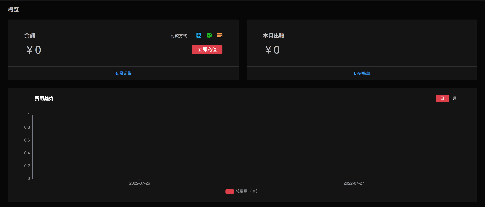
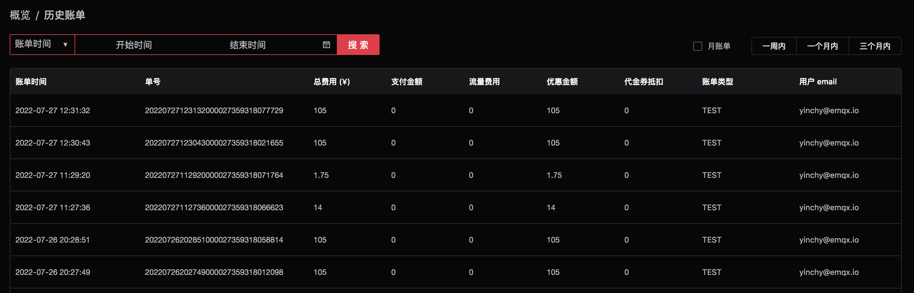

# 账单概览

概览将提供账户的余额、当月出账、费用趋势报告信息，以及充值、查看交易记录和历史账单的入口。点击顶部菜单中的 `财务管理` -> `概览` 可进入账单概览查看页面。

概览页面展示了以下三部分内容：

1. 账户余额，可点击 `充值` 按钮进行账户充值，付款方式支持 `支付宝`、`微信`。
2. 本月出账（本月 1 号至当前时间的出账费用）。
3. 费用趋势，可通过切换 `日`、`月` 来展示相对应的费用趋势。

## 充值

在概览页面点击 `充值` 按钮，输入充值金额，充值方式支持 `支付宝`、`微信`。如果需要 `对公汇款`，请联系我们的商务经理。

## 查看交易记录

交易记录将展示账户的充值、扣款记录。

1. 在 `概览` 页面中点击 `交易记录` 进入交易记录页面：

   

2. 若需查看一定时间范围内的交易记录，可指定起始和结束时间：

   

3. 交易记录页面点击 `概览` 可回到 `概览` 页面：

   

## 查看历史账单

历史账单将展示账户的出账记录

1. 在 `概览` 页面中点击 `历史账单` 进入账单页面

   

2. 可点击测试名称跳转到具体的测试结果进行查看：

   

3. 若需查看一定时间范围内的账单，可指定起始和结束时间：

   

4. 若需查看每月的账单，可勾选 `月账单` ：

   

5. 若需快速查看一周内、一个月内、三个月内的账单，可分别选择相应时间段：

   