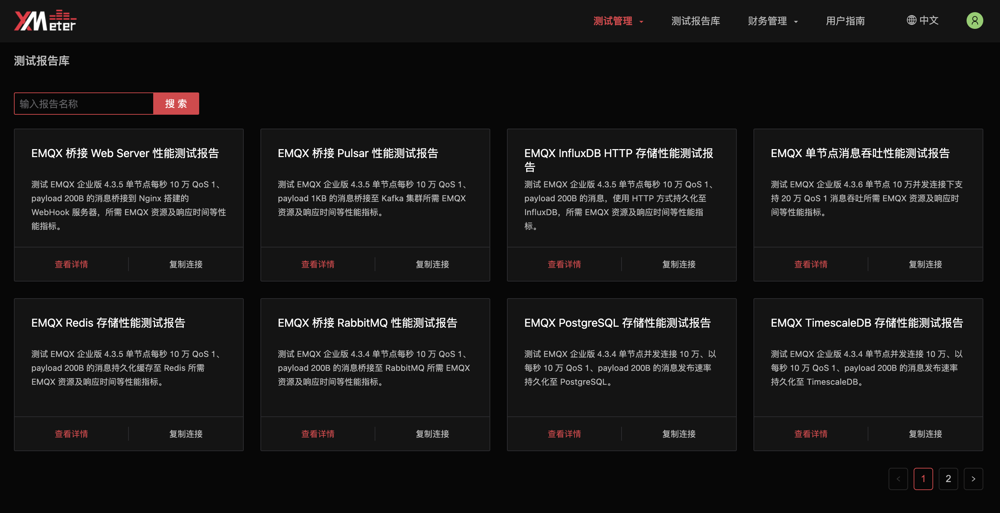
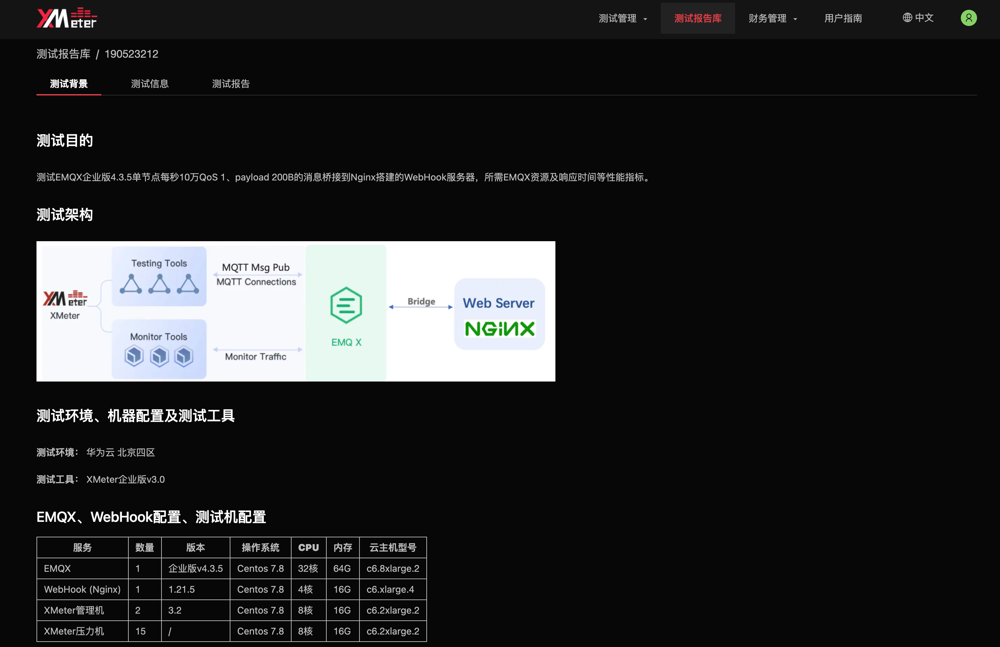

# 测试报告库

测试报告库将展示 XMeter Cloud 在不同的实战测试场景下的性能测试报告。

您无需登录即可查看，登录后可进行报告下载。点击 ` 复制链接 ` 可以链接形式进行分享。

## 查看报告详情

测试报告库中的每份性能测试报告页面展示了三部分内容：测试背景、测试信息、测试报告图表，其中测试信息与测试报告图表可参考 [测试报告](../features/test_reports.md) 进一步了解。

### 测试背景

测试背景中将展示测试目的、测试架构、测试环境、测试配置、测试结果等内容。

