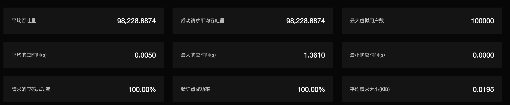
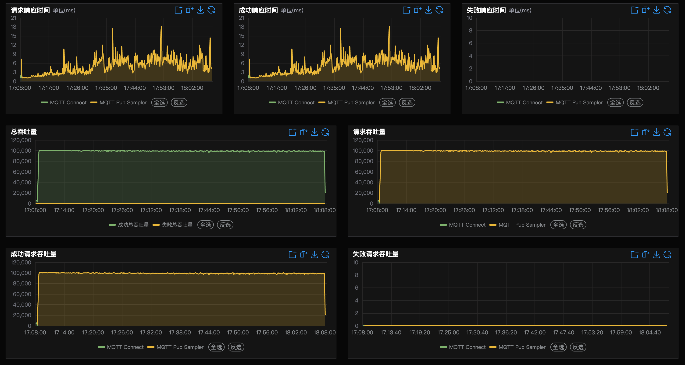
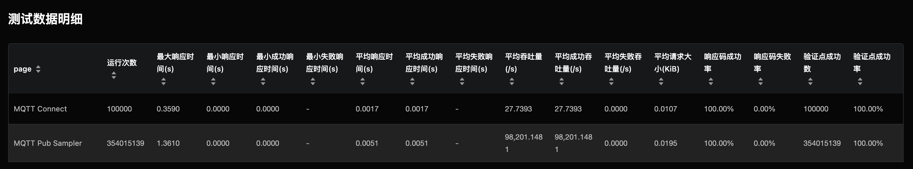

# 测试报告库

[EMQX](https://www.emqx.com/zh/products/emqx) 是一款大规模可弹性伸缩的云原生分布式物联网 MQTT 消息服务器，它提供了高效可靠海量物联网设备连接，能够高性能实时移动与处理消息和事件流数据，帮助快速构建关键业务的物联网平台与应用。

测试报告库展示了使用XMeter在不同场景下对EMQX压测产生的性能测试报告，用户无需登录即可查看，登录后可下载详细测试报告。如果想分享测试报告，点击复制链接即可。

## 查看详情

测试报告库中的每一个性能测试报告分成三大部分，测试场景，测试信息，测试报告。

### 测试场景

测试场景中展示了测试目的，测试架构，测试环境，测试配置，测试结果等内容。

### 测试信息

测试信息中展示了具体的测试配置及运行信息。

### 测试报告

测试报告中展示了压测后的详细的测试结果

- 第一部分展示了本次测试的汇总信息，反映出整个测试的状况。
  - 平均吞吐量：每秒完成的页面操作请求数(即throughput，吞吐率)
  
  - 成功请求平均吞吐量：每秒完成的验证点成功的页面操作请求数。
  
  - 最大虚拟用户数：系统曾经达到的最多并发用户数。
  
  - 平均、最大、最小响应时间：所有页面的平均响应时间，单位是秒。

  - 请求响应码成功率：所有页面的成功响应所占的比例。
  
  - 验证点成功率：、统计验证点的成功率。
  
  - 平均请求大小：所有请求返回内容的平均大小。
  
    
  
- 报告中部的几张图展示了随时间变化的页面响应时间，系统吞吐量，系统用户数，返回码成功率，网络下载流量的变化趋势。
    

- 报告最后的部分是“测试数据明细”，可以查看按页面统计的响应时间，吞吐量，请求返回响应的大小，成功率和标准方差，90分位响应时间等。
    