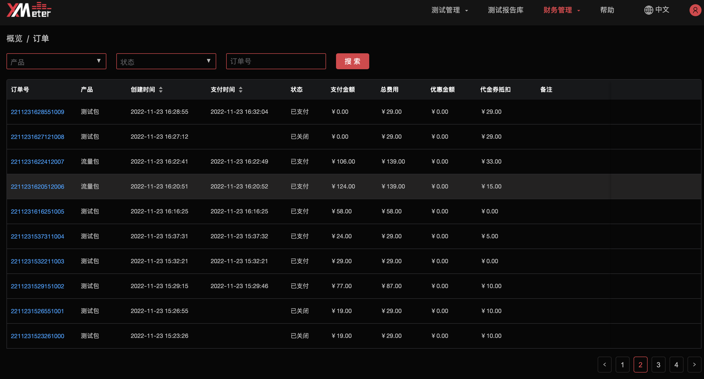
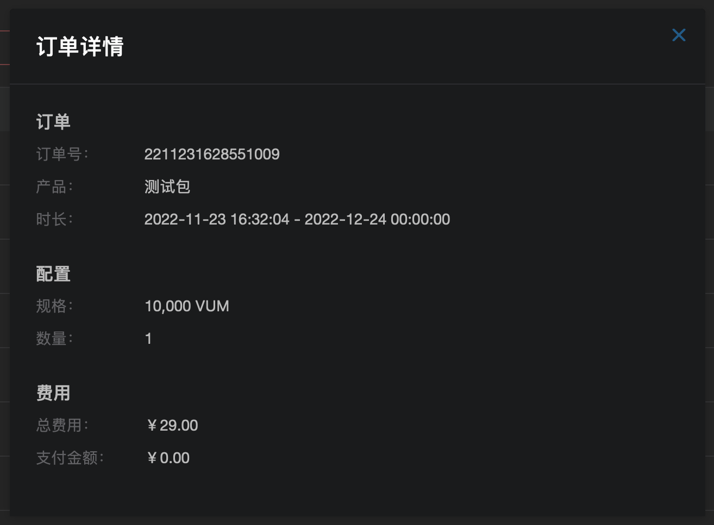

# 订单

> 注意
>
> 该功能在基础版中不可用

订单页面展示了您所有消费的产品详情。目前订单包括的产品只有测试包和流量包。

1. 专业版用户在购买了资源包后，会自动跳转到订单页面。或者您也可以点击`财务概览`，点击`全部订单`，进入订单页面。

   

2. 可对订单列表根据产品，状态进行过滤。也可以按照创建时间，支付时间来排序。

3. 点击`订单号`，可以查看该订单的详细信息。

   

4. 可以对之前的未支付的订单进行`支付`或者`取消`。系统将会自动取消超过**15天**未支付的订单。

