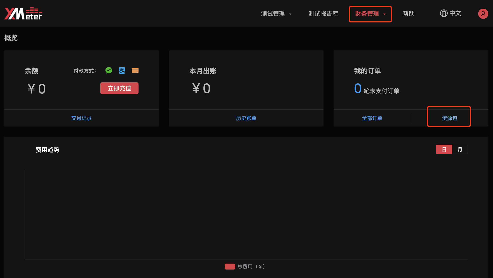
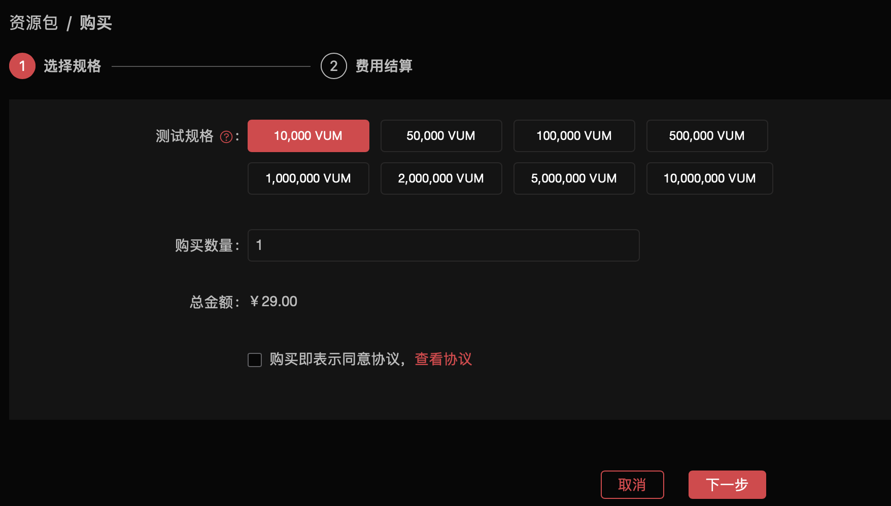
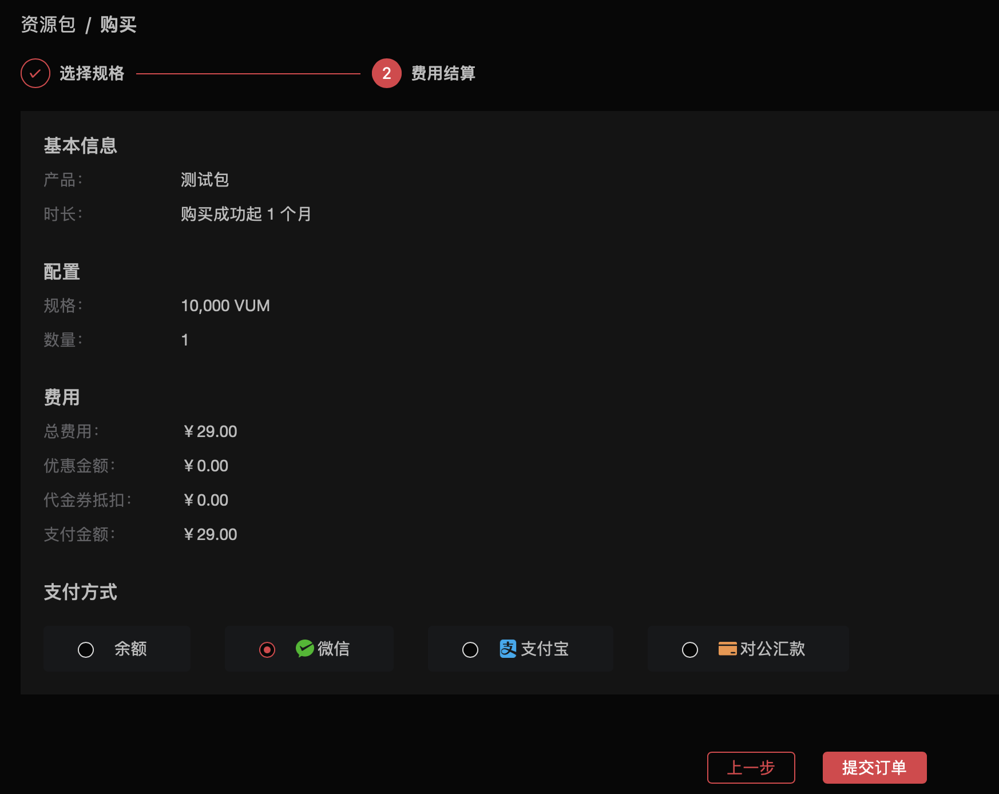
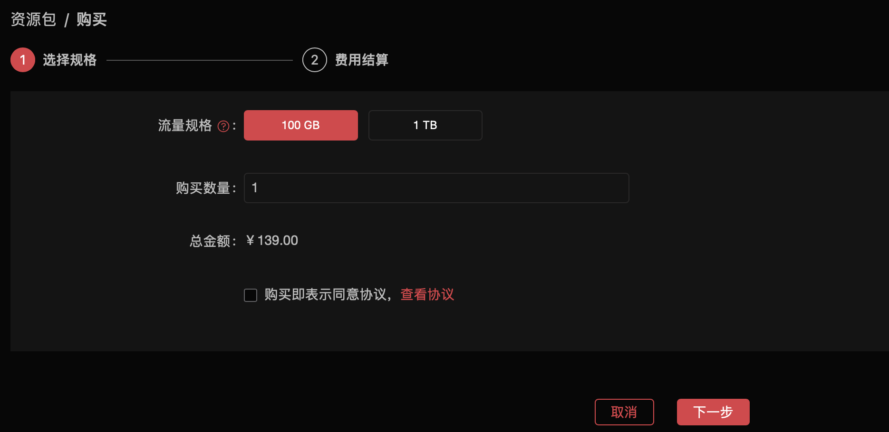
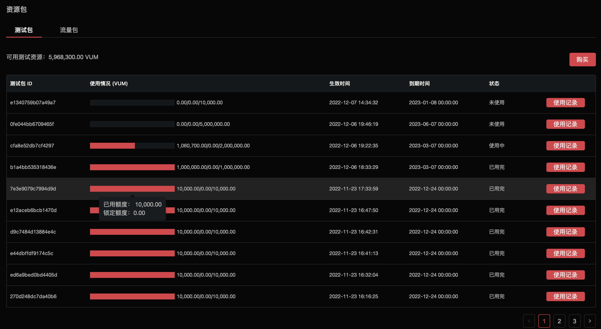
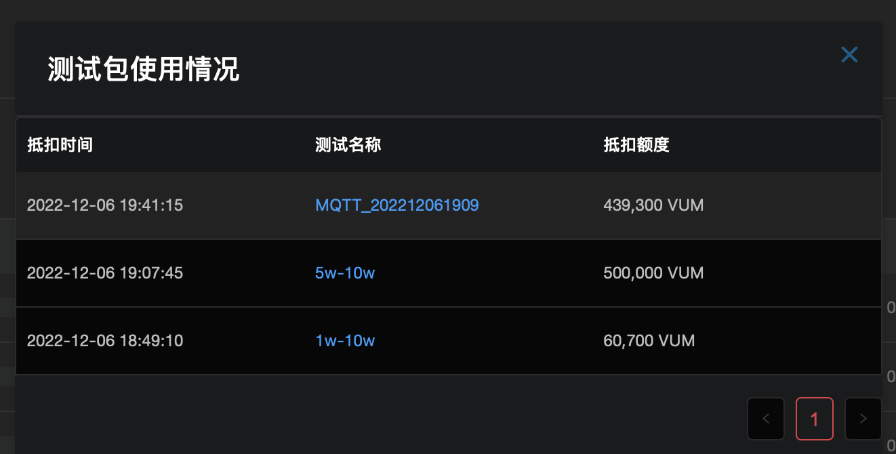

# 资源包

> 注意
>
> 该功能在基础版中不可用

专业版测试，将会支持更大规模的并发测试，大规模测试在运行中，会产生较高测试资源的消耗，XMeter Cloud 专业版的定价模式是采用连接数，运行时间作为主要计价衡量因素，相较于基础版只按照运行时间计价会更加经济实惠。

为了方便计算费用，专业版XMeter Cloud 定义了一个概念**VUM**，作为衡量资源消耗的单位，

VUM = VU(连接数) * M(运行时间)

**VU**表示**连接数**，**M**表示**实际运行时间**，单位是分钟，例如一个测试配置1000个连接，运行10分钟，那么所消耗的VUM是10000，一个测试配置100个连接，运行5分钟，那么所消耗的VUM是500。

为了节省资源费用，XMeter Cloud 推出不同规格的资源包，用户可以根据自己的实际情况选择购买。

## 资源包规格及计费规则

用户可以在财务概览页面进入资源包，一次性按需购买多个资源包。

1. 资源包分为两种类型，**测试包，流量包**，测试包只涵盖消耗的除流量以外的测试相关基础资源，如服务器，集群，使用VUM来估算，流量包包含公网测试产生的流量。

2. 用户购买资源包，支持**余额支付、支付宝支付、微信支付、对公汇款**多种支付方式，购买后，就可以去发起测试，测试完成后会自动抵扣相应消耗的资源包。

3. 在测试运行中，系统会每分钟计算一次消耗的流量，并使用流量包进行抵扣，测试完成后，系统会自动计算消耗的VUM，并使用测试包进行抵扣。如发起一个10分钟，100连接的测试，实际在测试运行1分钟后，便取消了测试，那么消耗的VUM为100。公网测试，消耗流量以实际为准。

4. 用户需尽量在**有效期**前使用完资源包，资源包到期后，不支持退款，到期后未使用的资源包将无法继续用来抵扣测试消耗。不支持转移到其他资源包。

5. 当用户由基础班升级到专业版时，系统将会自动赠送用户 1GB 的流量，可以在资源包的流量包页面查看。

6. 目前XMeter Cloud提供了多种规格的资源包，资源包的**定价**参考如下。

   ​																				**流量包定价参考**

   | 流量  | 定价（¥） | 有效期 |
   | :---: | :-------: | :----: |
   | 100GB |    139    | 6个月  |
   |  1TB  |   1299    |  1年   |

   ​																			**测试包定价参考**

   |    VUM     | 定价（¥） | 有效期 |
   | :--------: | :-------: | :----: |
   |   10,000   |    29     | 1个月  |
   |   50,000   |    139    | 1个月  |
   |  100,000   |    259    | 1个月  |
   |  500,000   |   1229    | 1个月  |
   | 1,000,000  |   2299    | 3个月  |
   | 2,000,000  |   4399    | 6个月  |
   | 5,000,000  |   10099   | 3个月  |
   | 10,000,000 |   19099   |  1年   |

## 测试包购买流程

1. 用户可以在升级为专业版后，进入`财务概览`，点击`资源包`，进入到`测试包`页面，点击购买。
    

2. 选择测试包规格、购买数量之后，同意服务协议之后，点击`下一步`。
   

3. 进入`费用结算`页面，仔细查看选择支付方式，确认购买的详细信息，如您账户中包含优惠券，将会自动展示出来。

   - 支付方式选择`余额`，点击，会自动扣除余额，如果余额不足，可在账务管理下的`概览`页面，进行余额充值。
   - 支付方式选择`微信`或者`支付宝`，点击`提交订单`，可直接通过扫码支付。
   - 支付方式选择`对公汇款`，可以直接拨打电话，联系客服人员进行对公汇款。

   

4. 购买成功后会自动跳转到`订单`页面。如果您不想立刻支付订单，可稍后在订单页面去支付。

## 流量包购买流程

1. 和购买测试包相同，进入`财务概览`的`资源包`页面，切换到`流量包`页面，点击购买

2. 选择流量包规格、购买数量之后，同意服务协议之后，点击`下一步`。

   

3. 进入费用结算页面，支付方式和测试包购买相同。
    

4. 选择支付方式，点击`支付`，即可成功开通测试包服务。如果您不想立刻支付订单，可稍后在订单页面去支付。

5. 购买成功后会自动跳转到订单页面.

## 资源包详情

资源包页面展示了用户之前购买的所有资源包信息。

1. 用户可以通过财务概览，点击`资源包`进入该页面。
2. 资源包页面分为测试包，流量包。测试包的使用情况，展示了当前测试包的已用额度，锁定额度。其中**锁定额度**，表示当前有正在运行中的测试，这部分VUM提前锁定，再次提交测试，则不能抵扣这部分额度。流量包的使用情况展示了当前流量包已使用的流量。单位是GB。
3. 点击右侧操作的`详情`，可查看到资源包使用详情。包括抵扣时间，测试名称，抵扣额度。点击测试名称，会自动跳转到该测试的测试报告。