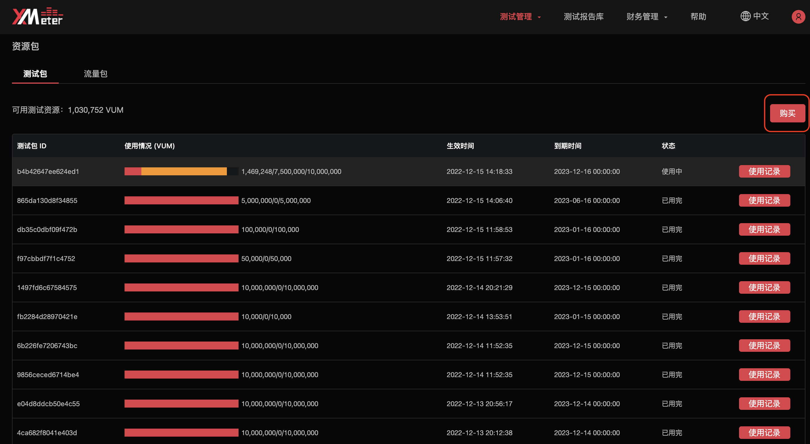
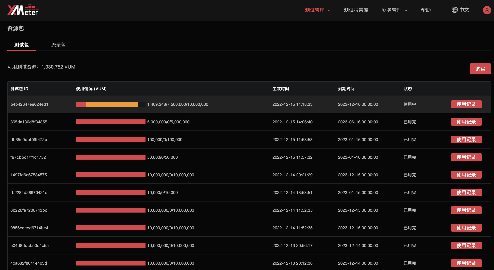
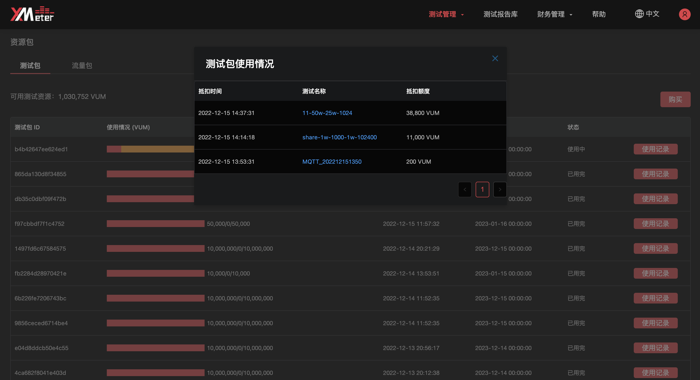

# 测试包

> 注意
>
> 该功能在基础版中不可用

专业版支持更大规模的并发测试，不同规模的测试将使用不同的测试机资源。为了提供更精确的计价方式，专业版使用 **VUM** 作为衡量测试资源消耗的单位，并根据 VUM 计算测试费用：

VUM = VU (连接数) * M (测试时长，以分钟计)

举例：测试配置了 1,000 个连接数，测试运行了 10 分钟，计费的 VUM 为 10,000。测试配置了 10,000 个连接数，测试运行了 1 分钟，计费的 VUM 也是 10,000。

基于 VUM，XMeter Cloud 推出不同规格的测试包，您可以根据自己的实际测试需求选购。专业版中，需要预付费购买测试包后再运行测试，如果账户中可用的测试包额度少于您配置的测试所需的 VUM，将无法提交测试。

## 测试包规格及计费规则

### 规格

XMeter Cloud 提供多档 VUM 的测试包，单个测试包可用于多个测试中，直至用完。

|    VUM     | 定价（¥） | 有效期 |
| :--------: | :-------: | :----: |
|   10,000   |    29     | 1个月  |
|   50,000   |    139    | 1个月  |
|  100,000   |    259    | 1个月  |
|  500,000   |   1229    | 1个月  |
| 1,000,000  |   2299    | 3个月  |
| 2,000,000  |   4399    | 6个月  |
| 5,000,000  |   10099   | 3个月  |
| 10,000,000 |   19099   |  1年   |

### 计费规则

1. 多个测试包可叠加使用，测试优先抵扣有效期近的测试包。
2. 测试提交后，系统将根据测试配置所需的 VUM 锁定相应测试包的额度。
3. 测试结束后，系统将根据使用的 VUM 从测试包中抵扣对应的额度，并释放多锁定部分的 VUM。如果测试实际消耗的 VUM 少于测试配置（如：中途取消测试），将会按实际发生抵扣。
4. 测试包需在有效期内使用，逾期未使用的剩余测试包资源不支持退订，也不能转移到其他测试包。请注意测试包即将到期的提醒。

## 测试包购买流程

1. 在概览页面点击 `资源包` 按钮。
   

2. 进入资源包页面后，切换到 `测试包` 标签页，点击 `购买` 

   

3. 选择测试包规格、购买数量，同意服务协议之后，点击`下一步`。每种规格测试包的单次购买上限为 100 个。
   

4. 进入 `费用结算` 页面，确认订单的详细信息，并选择支付方式。如果您的账户中包含可用于测试包的代金券，将会自动用于订单抵扣。

   - 支付方式选择 `余额`，将从余额中扣除订单支付金额。
   - 也可以直接通过 `微信` 或者 `支付宝` 支付订单支付金额。
   - 如果您需要 `对公汇款`，可以直接拨打电话，联系客服人员通过线下方式支付订单。

   

5. 购买成功后将自动跳转到 `订单` 页面。如果您不想立刻支付订单，可稍后从订单页面支付。超过 **7** 天未支付的订单将被自动取消。

## 测试包详情

购买测试包之后，您可以通过以下方式查看详情。

1. 在概览页面点击 `资源包` 按钮，进入资源包页面，并切换到 `测试包` 标签页。
2. 在测试包详情页面可查看到可用测试资源及各个测试包的使用情况。使用情况展示了测试包的已用额度、锁定额度、生效时间、到期时间、状态。**锁定额度**表示被正在运行中的测试锁定的 VUM 部分，被锁定的 VUM 在该测试结束前无法用于新的测试。
3. 点击右侧操作的 `使用记录`，可查看到测试包的抵扣详情，包括抵扣时间、测试名称、抵扣额度。点击测试名称，将跳转到对应测试的测试报告页面。
