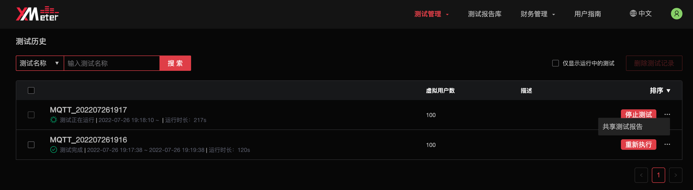
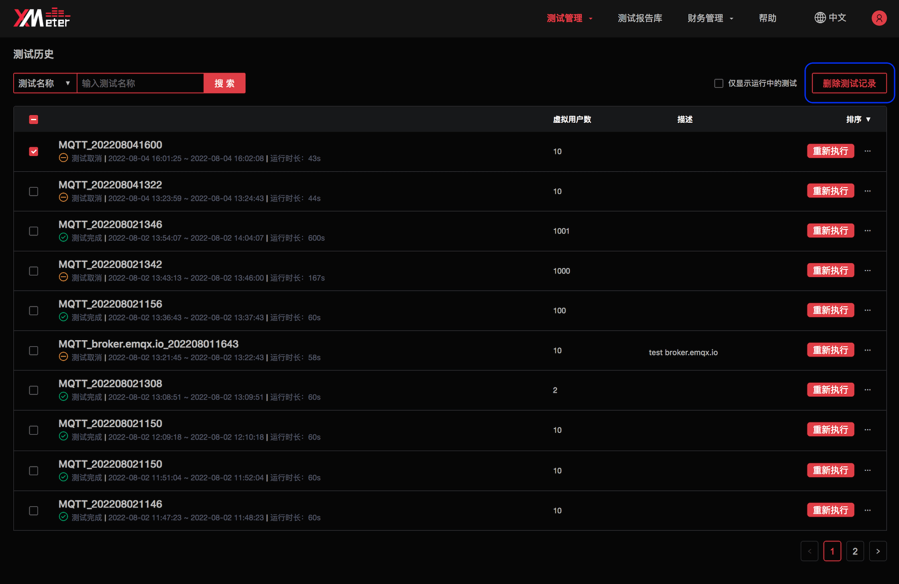

# 测试历史

测试历史将展示已发起的测试。

1. 在测试中心页面中点击 `历史记录` ，或点击顶部菜单中的 `测试管理` -> `测试历史` ，可进入测试历史页面。

   

2. 可使用测试名称、仅显示运行中的测试的过滤方式查看测试历史。

3. 也可以对测试历史通过开始时间、结束时间进行排序。

4. 点击测试名称，将进入测试报告页面展示测试详情及可视化报告。

5. 测试在运行状态下，您可以点击右侧 `停止测试` 按钮停止测试。

6. 测试完成后，如果您希望按照上一次的测试配置重新执行该测试，可以点击右侧 `重新执行` 按钮。

7. 点击右侧 `...` 按钮，将展开更多操作项。您可以通过 `共享测试报告` 按钮共享该测试报告，共享后，其他用户通过访问该测试报告的 url 链接，即可查看测试报告内容。您也可以通过 `取消共享` 停止共享该测试报告。

8. 勾选测试后，您可以点击 `删除测试记录` 按钮批量删除测试记录。

