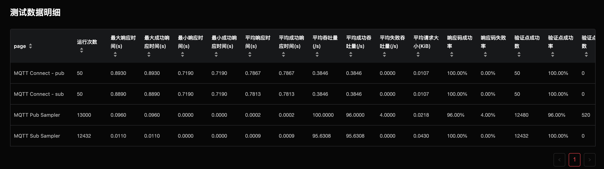

# 测试报告

本文将介绍测试报告的具体内容，测试报告用于展示每一次测试的详细情况，帮助用户了解被测服务的性能情况。

当用户发起一次测试后，系统会自动跳转到该测试的测试报告的页面。另外用户也可以从测试历史页面进入相应测试的测试报告页面。

测试报告页面展示了以下四部分内容：

## 1.测试信息

测试信息包括用户发起测试时的一些场景配置信息以及测试运行信息。

## 2.测试报告

测试报告展示了测试运行过程中的详细情况，在测试运行过程中，这些性能指标实时变化，通过对他们的分析，帮助用户了解被测服务的性能。

- 第一部分展示了本次测试的汇总信息，反映出整个测试的状况。
  - 平均吞吐量：每秒完成的页面操作请求总数(即throughput，吞吐率)
  - 成功请求平均吞吐量：每秒完成的验证点成功的页面操作请求总数。
  - 最大虚拟用户数：系统曾经达到的最多并发用户总数。
  - 平均、最大、最小响应时间：每秒钟所有页面的平均响应时间。
  - 请求响应码成功率：所有页面的成功响应所占的比例。
  - 验证点成功率：统计平均验证点的成功率。
  - 平均请求大小：所有请求返回内容的平均大小。

- 报告中部的几张图展示了随时间变化的页面响应时间，系统吞吐量，系统用户数，返回码成功率，网络下载流量的变化趋势。

- 报告最后的部分是“测试数据明细”，可以查看按页面统计的响应时间，吞吐量，请求返回响应的大小，成功率和标准方差，90分位响应时间等。

## 3.测试机状态

当测试启动后, 测试环境会被自动创建，我们可以通过了解CPU负载, 系统的CPU占用率, 用户进程的CPU占用率以及内存使用量来了解测试机的状态。

## 4.测试日志

在测试运行过程中，会产生大量的日志，我们将日志进行整理，方便用户在测试结束后在线查看测试日志，用来分析与追踪。

### 跟踪日志

测试模拟了多个用户并发与被测服务器交互，跟踪日志展示了部分交互过程中产生的请求，返回内容等。当点击某条请求时，将会在右侧看到该请求的详细信息，包括目标地址，请求方法，返回码，请求头和返回头等。

这些信息对于在性能测试过程中调试非常有用。如果某条的颜色为红色，则表示该次请求有错误（返回码错误，或者验证点有错误等。

### 错误日志

错误日志展示了测试运行过程中发生的不同错误，并统计了发生错误的次数。点击某一错误，同样可以看到发生错误的某一次请求的详细信息，同跟踪日志。

### 其他日志

用户可以在其他日志中查看运行过程中产生的JMeter日志，也可以下载全部日志文件。

