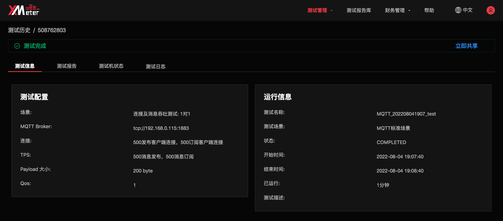
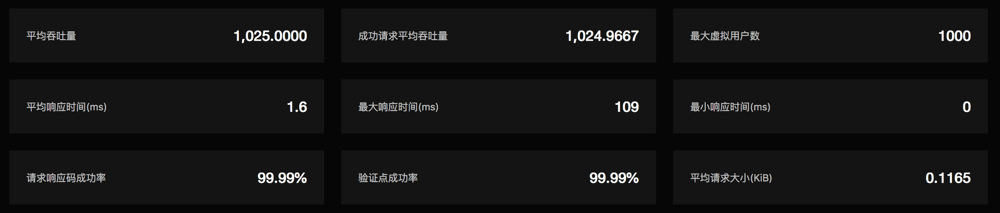

# 测试报告

测试报告将展示每一次测试的详细测试数据与测试情况，帮助您从多方面了解被测应用的性能状况。发起新的测试后，将自动跳转到该测试的测试报告页面，您也可以从测试历史页面打开相应测试的测试报告。

测试报告页面展示了以下四部分内容：

## 测试信息

测试信息将展示测试的运行配置信息和测试运行信息。

## 测试报告图表

测试报告图表将以可视化方式展示测试的详细性能指标。这些性能指标数据将随着测试的运行实时变化，通过对数据的分析，您可以对被测应用的性能有多维度的了解。

我们先介绍一些 XMeter Cloud 中的核心性能指标：

- 吞吐量：每秒完成的操作总数。如 MQTT 连接测试中的吞吐量，指每秒新建的连接数。MQTT 消息吞吐测试中的消息吞吐量，指每秒发布和订阅的总数。
- 响应时间：一次操作从发起到完成的时间。
- 90% 平均响应时间：所有操作的响应时间中前 90% 数据的平均值。90% 平均响应时间排除了部分波动数据对整体响应时间可能造成的影响。
- 虚拟用户数：每一个虚拟用户代表一个模拟客户端。如 MQTT 连接测试中的虚拟用户数，指模拟的连接数。MQTT 消息吞吐测试中的虚拟用户数，指发布模拟客户端或订阅模拟客户端的数量。
- 响应码成功率：所有操作中成功操作所占的比例。如 MQTT 连接测试中的响应成功率，指成功连接数占所有连接的比例。
- 验证点成功率：如果在操作完成后进行了额外的断言，验证点成功率指断言成功的比例。在 MQTT 标准测试场景中，验证点成功率与响应码成功率是一致的。
- 标准方差：该值越小，说明各操作之间的响应时间差异越小，被测应用的表现也越稳定。

报告上部展示了本次测试的汇总信息，是基于测试中的所有操作统计的，体现测试的整体状况。

报告中部的几张折线图展示了测试中各个操作的多个性能指标随时间变化的趋势，如：响应时间、吞吐量、虚拟用户数、成功率、网络流量等。

报告下部的 `测试数据明细` 展示了测试中各个操作的性能指标统计数据，如：运行次数、平均响应时间、90% 平均响应时间、平均吞吐量、成功率、标准方差等。

## 测试机状态

测试启动后，测试机资源将会自动创建。您可以通过 CPU 负载、CPU占用率、内存使用量来了解测试机的实时使用情况，作为判断测试是否在正常状态下运行的参考依据。

## 测试日志

测试日志将展示整理后的各类测试日志。您可以在测试运行中和测试完成后查看日志，以做进一步的分析。

### 跟踪日志

跟踪日志展示了模拟的并发客户端与被测应用之间的交互消息。您可以点击某条跟踪日志，在右侧将展示对应操作的详情信息。跟踪日志对性能测试过程中的调试很有帮助。

### 错误日志

错误日志展示了测试运行过程中发生的不同类型的错误，并统计了错误发生的次数。您可以点击某条错误日志，查看发生错误的操作的详细信息。

### 其他日志

您可以在其他日志中查看测试运行中产生的运行日志。也可以下载全部日志文件，以获取包括错误日志和跟踪日志在内的各类日志。

