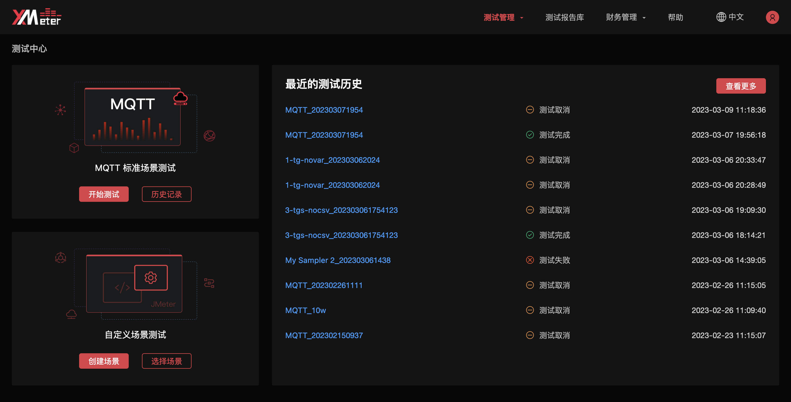
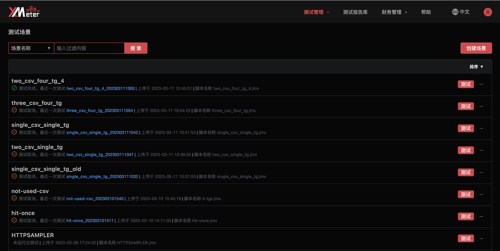
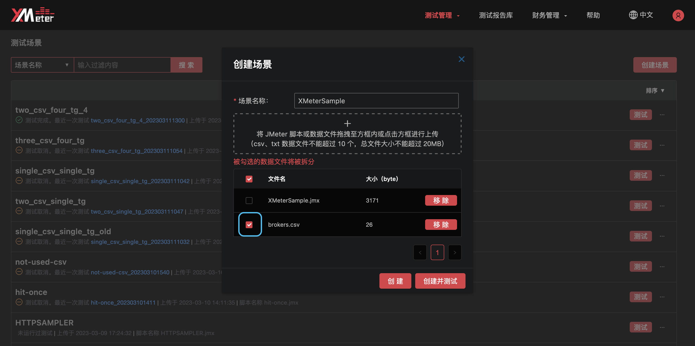
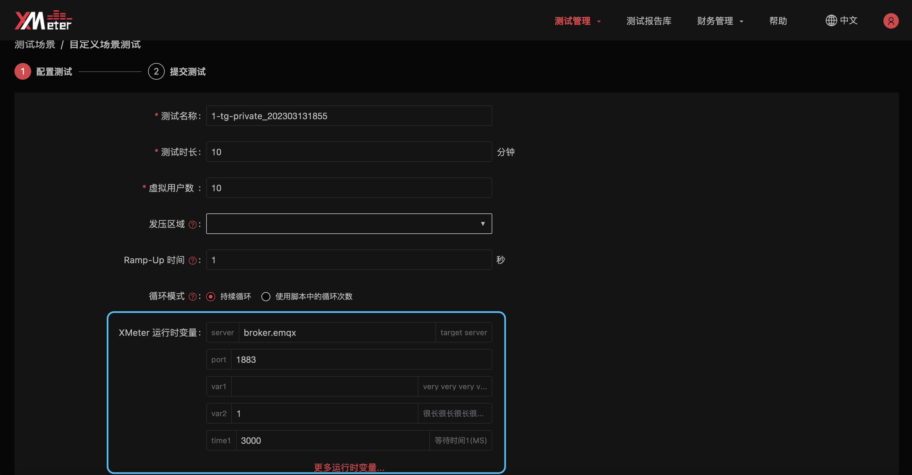
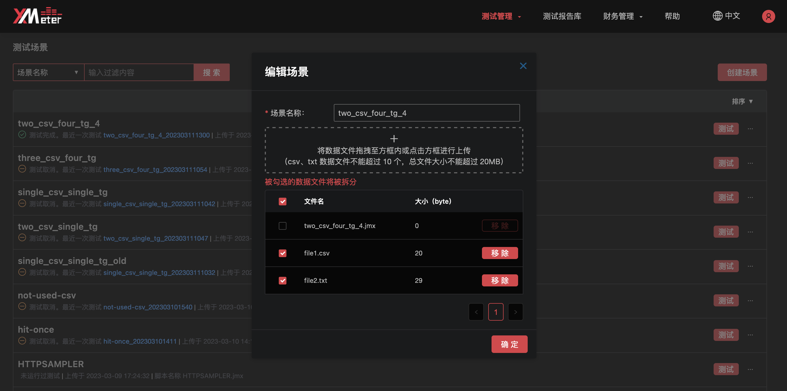
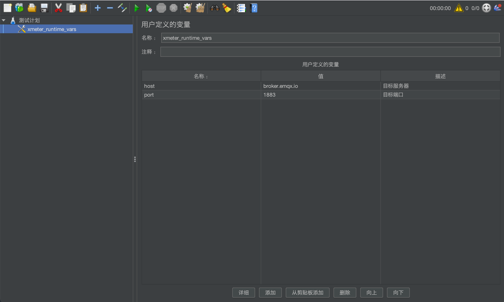

# 测试场景

::: warning
该功能在基础版中不可用
:::

测试场景将管理用户自定义的测试场景，包括查看场景列表、创建自定义场景、提交自定义场景测试、编辑自定义场景、删除自定义场景、下载自定义场景脚本。

1. 在测试中心页面点击 `自定义场景测试` 中的 `选择场景` ，或点击顶部菜单中的 `测试管理` -> `测试场景` ，可进入测试场景页面。

   

2. 可使用场景名称过滤查看自定义测试场景。

3. 也可以通过场景名称、上传时间对自定义测试场景进行排序。

4. 页面中将展示每个自定义测试场景最近一次的测试状态和测试名称，以及该场景的上传时间、所包含的脚本名称。点击最近一次的测试名称，将进入测试报告页面展示测试详情及可视化报告。

   

## 创建场景

1. 在测试场景页面点击 `创建场景` 按钮。

2. 选择后缀名为 .jmx 的 JMeter 脚本文件至上传框中。每个自定义场景中应只包含 1 个 JMeter 脚本，脚本需兼容 JMeter 5.0 及以上版本。自定义场景支持  JMeter 内置的测试组件和取样器，例如 HTTP 请求取样器、TCP 取样器、JDBC 请求取样器等，也支持 XMeter 开源的 [MQTT 插件](https://github.com/emqx/mqtt-jmeter)提供的连接、发布、订阅取样器。如果您希望在脚本中使用更多第三方的 JMeter 扩展插件，请联系我们。

   

3. 如果您在 JMeter 脚本中使用了 CSV 数据文件，请将这些后缀名为 .csv 或 .txt 的数据文件存放于  JMeter 脚本的同级目录中进行引用（即 `CSV 数据文件设置` 的文件名中不要包含路径），并逐个上传。目前自定义场景中支持的数据文件，总数不超过 10 个，总文件大小不超过 20 MB。

4. XMeter Cloud 运行测试时，会根据测试规模启动一个或多个测试机实例以模拟负载。默认情况下，所有的数据文件都将被完整地分发到各台测试机上。如果您的测试中需要确保同一条测试数据不被重复使用，请使用数据文件拆分功能，将需要拆分的数据文件进行勾选。

   例如，数据文件中保存了 MQTT Client ID，如果同一个 Client ID 在不同的测试机中多次连接 MQTT Broker，后续连接请求将会被拒绝。而启用了数据文件拆分功能后，XMeter Cloud 会根据每台测试机的负载情况，将数据文件拆分后分发到相应测试机上，以确保不同的测试机使用不同的测试数据。（查看 <a href="#数据文件拆分">数据文件拆分</a> 了解拆分方法）

   

5. 使用默认的场景名称，或输入设置。

6. 点击 `创建` 按钮，完成自定义场景的创建。也可以点击 `创建并测试` 按钮，在场景完成创建后直接进入测试配置页面。

## 提交自定义场景测试

1. 点击场景右侧 `测试` 按钮。

   

2. 使用默认的测试名称，或输入设置。

3. 指定以分钟为单位的测试时长。

4. 配置虚拟用户数，以指定测试中需模拟的并发数。默认的虚拟用户数为 JMeter 脚本线程组中所设置的线程数。如果脚本中仅有 1 个线程组，只需要设置该线程组的虚拟用户数即可；如果脚本中包含多个线程组，“虚拟用户数”展示的是所有线程组的总数，点击可进一步配置各个线程组的虚拟用户数。每个线程组的虚拟用户数都应为正整数。

5. 如果需要使用 VPC 对等连接进行私网测试，请指定发压区域。发压区域与对等连接中 XMeter 端 VPC 所属区域对应，指定发压区域后，将从该区域发起压测，测试机与该区域所配置的对等连接中的对端可互相通信。

6. 如果需要指定测试并发的递增速度，请配置 Ramp-Up 时间，它指定了测试将在多少秒内匀速生成所有的虚拟用户。默认的 Ramp-Up 时间为 1 秒。

7. 如果需要为测试提供进一步的说明信息，请设置描述内容。

8. 如果您的测试需要在多次运行中使用不同的参数，可以使用 XMeter Cloud 的运行时变量功能简化测试场景的维护。例如，需要在集成测试中对测试环境进行压测，也需要在端对端测试中对准生产环境进行压测，两套环境使用相同逻辑的测试脚本，但目标服务器地址和端口等信息不同。这种情况下，如果维护两个自定义场景分别对应两套环境，将不利于后期的维护。而使用运行时变量后，可简化操作，方便维护。

   启用运行时变量功能需要在 JMeter 脚本中使用指定的 `用户定义的变量` 组件（查看 <a href="#在脚本中设置运行时变量">在脚本中设置运行时变量</a> 了解使用方法），这些变量将展示在测试配置页面中。您可无需反复修改 JMeter 脚本，从页面上设置本次运行所需的参数值即可。

   

9. 确认测试配置与费用后，点击 `立即测试` 按钮提交测试。

## 编辑自定义场景

1. 点击场景右侧 `...` 按钮，将展开更多操作项。您可以通过 `编辑测试场景` 对自定义场景进行编辑。

2. 支持对场景名称、数据文件、数据文件拆分进行编辑。

   

## 删除自定义场景

1. 点击场景右侧 `...` 按钮，点击 `删除测试场景` ，将删除当前自定义场景。
2. 场景对应的所有测试记录也将被删除，请谨慎操作。

## 数据文件拆分

测试运行过程中，XMeter Cloud 会根据每台测试机上分配到的虚拟用户数，将勾选了拆分的数据文件进行分解，并分发到各台测试机上，这样每台测试机上都会使用不同的测试数据。

数据文件拆分功能启用后，实际被使用的测试数据条数与它所在线程组的虚拟用户数相同。如果数据文件的条数少于所在线程组的虚拟用户数，其中的测试数据将不足以分给所有的测试机，测试将会失败；如果数据文件条数超过所在线程组的虚拟用户数，多余的测试数据也将不会被使用。

举例：脚本中只有 1 个线程组，该线程组使用了数据文件 data.csv 并对其进行了数据拆分，data.csv 中包含 20,000 条数据。测试设置了 10,000 个虚拟用户，系统分配这 10,000 个虚拟用户到 5 台测试机上，每台测试机模拟 2,000 个用户。那么在测试运行过程中：

| 测试机        | 使用的 data.csv 中的数据  |
| ------------- | ------------------------- |
| 第 1 台测试机 | 第 1 条至第 2,000 条      |
| 第 2 台测试机 | 第 2,001 条至第 4,000 条  |
| 第 3 台测试机 | 第 4,001 条至第 6,000 条  |
| 第 4 台测试机 | 第 6,001 条至第 8,000 条  |
| 第 5 台测试机 | 第 8,001 条至第 10,000 条 |

而第 10,001 条至第 20,000 条数据将不被本次测试所使用。

## 在脚本中设置运行时变量

为了使用 XMeter Cloud 的运行时变量功能，需要对上传的 JMeter 脚本进行适配。

从 JMeter 中打开脚本，在测试计划下加入一个名为 xmeter_runtime_vars 的 `用户定义的变量` 组件，并将每次测试运行时可能需要使用不同值的参数加入该组件中。例如：在 xmeter_runtime_vars 变量组件中加入 2 个变量，分别叫做 host 和 port。

请注意，脚本中只能有 1 个 xmeter_runtime_vars 的 `用户定义的变量` 组件，否则将无法上传脚本。xmeter_runtime_vars 中变量的数量不限。