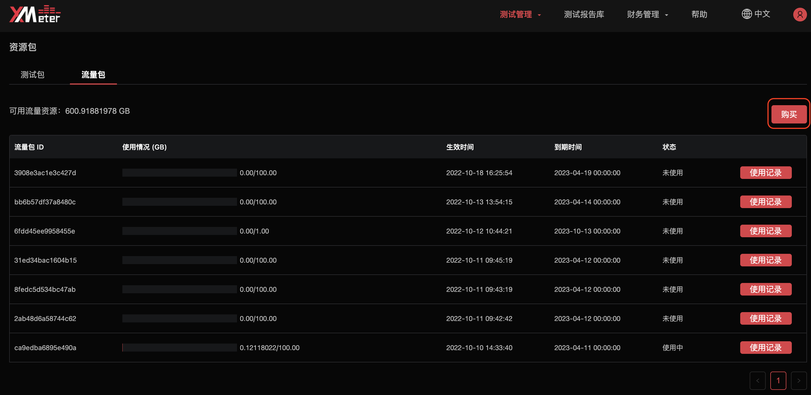

# 流量包

::: warning
该功能在基础版中不可用
:::

专业版的测试包仅用于涵盖测试相关的基础资源费用，不包括公网测试产生的流量部分。如果您需要通过公网进行测试，可以使用余额抵扣测试中 XMeter Cloud 端产生的公网流量费用，或者预付费购买流量包后使用流量包抵扣公网流量。

升级到专业版时，系统将会自动赠送您 1GB 的流量包（有效期 3 个月），以方便您快速进行测试验证使用。

## 流量包规格及计费规则

### 规格

XMeter Cloud 提供 100 GB、1 TB 两种规格的流量包。

|  流量  | 定价（¥） | 有效期 |
| :----: | :-------: | :----: |
| 100 GB |    139    | 6个月  |
|  1 TB  |   1,299   |  1年   |

### 计费规则

1. 公网测试运行中，系统每分钟计算一次消耗的流量，并优先使用流量包抵扣流量费用。
2. 多个流量包可用于同一个测试，优先抵扣有效期近的流量包。
3. 流量包中的流量使用完后，继续按 ￥1.5/GB 的流量费用从余额中扣除。如果余额低于账户允许的透支额度，测试将被中断。请在测试中及时关注流量情况。
4. 流量包需在有效期内使用，逾期未使用的剩余流量包资源不支持退订，也不能转移到其他流量包。请注意流量包即将到期的提醒。

## 流量包购买流程

1. 在概览页面点击`资源包` 按钮。

   

2. 进入资源包页面后，切换到 `流量包` 标签页，点击 `购买` 

   

3. 选择流量包规格、购买数量，同意服务协议之后，点击`下一步`。每种规格流量包的单次购买上限为 100 个。

   

4. 进入 `费用结算` 页面，确认订单的详细信息，并选择支付方式。如果您的账户中包含可用于流量包的代金券，将会自动用于订单抵扣。

   

5. 购买成功后将自动跳转到 `订单` 页面。如果您不想立刻支付订单，可稍后从订单页面支付。超过 **7** 天未支付的订单将被自动取消。

## 流量包详情

购买流量包之后，您可以通过以下方式查看详情。

1. 在概览页面点击 `资源包` 按钮，进入资源包页面，并切换到 `流量包` 标签页。
2. 在流量包详情页面可查看到可用流量资源及各个流量包的使用情况。使用情况展示了流量包的已用额度、生效时间、到期时间、状态。

3. 点击右侧操作的 `使用记录`，可查看到流量包的抵扣详情，包括抵扣时间、测试名称、抵扣额度。点击测试名称，将跳转到对应测试的测试报告页面。

