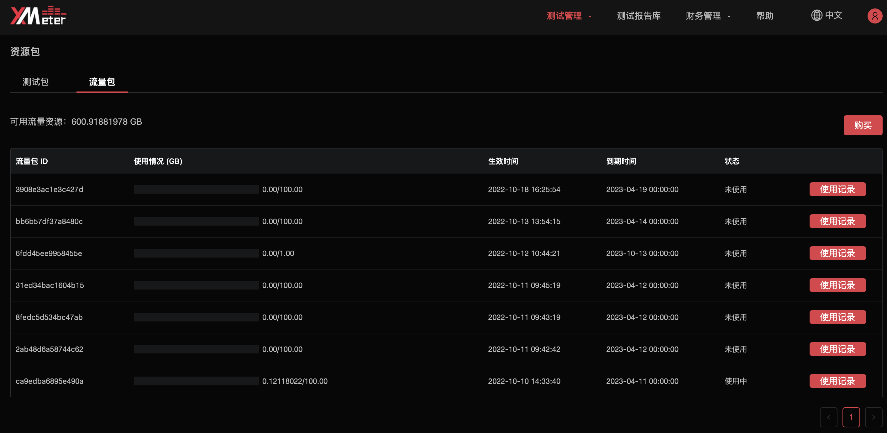
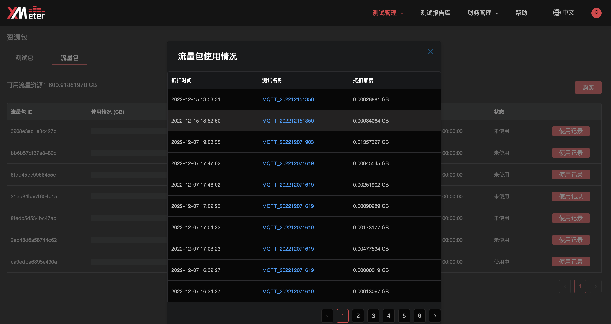

# 流量包

::: warning
该功能在基础版中不可用
:::

## 流量包购买流程

1. 在概览页面点击`资源包` 按钮。

   

2. 进入资源包页面后，切换到 `流量包` 标签页，点击 `购买` 

   

3. 选择流量包规格、购买数量，同意服务协议之后，点击`下一步`。每种规格流量包的单次购买上限为 100 个。

   

4. 进入 `费用结算` 页面，确认订单的详细信息，并选择支付方式。如果您的账户中包含可用于流量包的代金券，将会自动用于订单抵扣。

   

5. 购买成功后将自动跳转到 `订单` 页面。如果您不想立刻支付订单，可稍后从订单页面支付。超过 **7** 天未支付的订单将被自动取消。

## 流量包详情

购买流量包之后，您可以通过以下方式查看详情。

1. 在概览页面点击 `资源包` 按钮，进入资源包页面，并切换到 `流量包` 标签页。
2. 在流量包详情页面可查看到可用流量资源及各个流量包的使用情况。使用情况展示了流量包的已用额度、生效时间、到期时间、状态。

3. 点击右侧操作的 `使用记录`，可查看到流量包的抵扣详情，包括抵扣时间、测试名称、抵扣额度。点击测试名称，将跳转到对应测试的测试报告页面。

