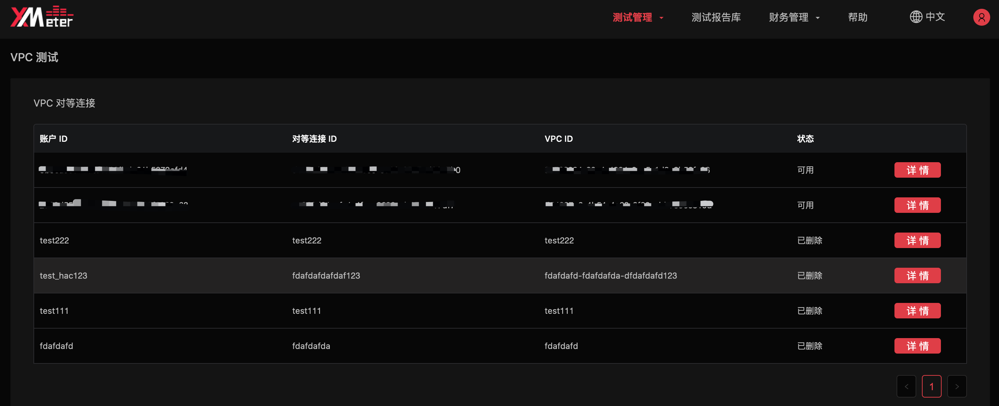
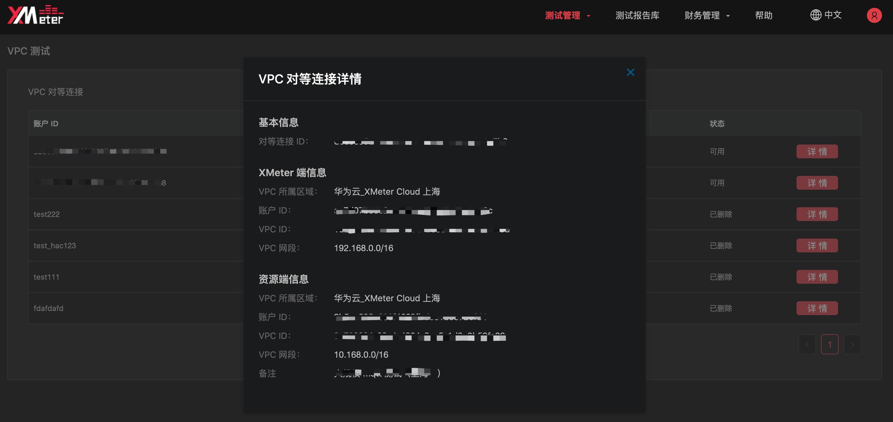
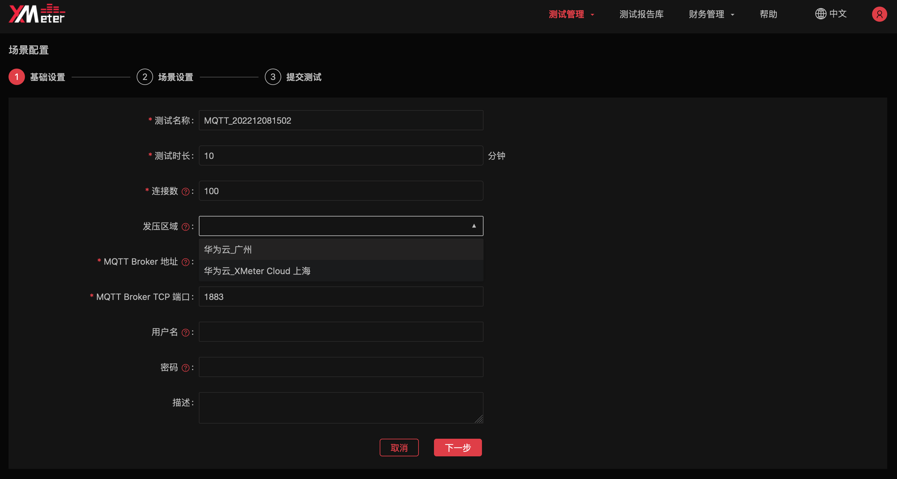
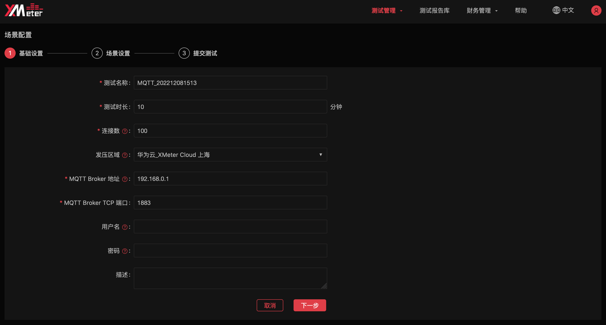
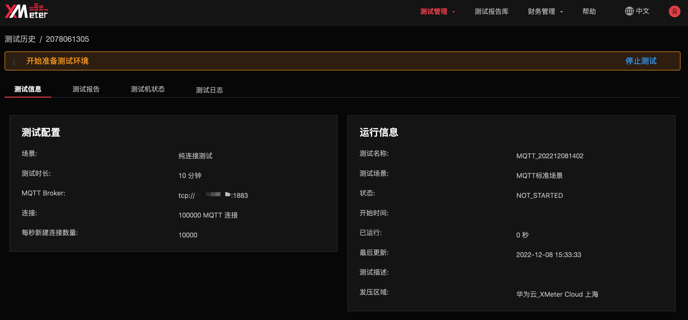

# VPC 对等连接

::: warning
该功能在基础版中不可用
:::

VPC 对等连接是两个 VPC 之间的网络连接，通过此连接，使两个 VPC 中的实例可以彼此通信，就像它们在同一网络中一样。

## 注意事项

1. XMeter Cloud 只支持**同一区域**创建对等连接。
2. 对等连接与被测服务/应用相互绑定，请联系我们，我们的技术团队将协助您一起创建对等连接。
3. XMeter Cloud 目前只支持华为云平台的 VPC 对等连接。如果您的被测服务/应用在其他云平台上，请与我们联系。

## 查看对等连接

1. 点击顶部菜单中的 `测试管理` -> `VPC 测试`，可进入 VPC 详情页面。

   

2. 点击 `详情` 可查看对等连接两端的 VPC 信息：XMeter 端信息展示的是 XMeter Cloud 自身的 VPC 信息，资源端信息展示的是用户被测服务/应用所在的 VPC 信息。目前用户可在每个支持的区域与 XMeter Cloud 建立最多一个 VPC 对等连接，该区域的服务/应用在测试中即可与 XMeter Cloud 通过 VPC 对等连接互相通信。

   

## 进行私网测试

1. 在测试场景配置的基础配置中，用户已建好对等连接的区域将显示在 `发压区域` 下拉选项中。

   

2. 选择一个发压区域后，位于相应对等连接中用户端 VPC 内的服务/应用即可通过内网 IP 进行测试，将该内网 IP 地址填入  `MQTT Broker 地址` 中。

   

3. 测试成功提交后，可在`测试信息`标签页下的`运行信息`卡片中看到关联的发压区域信息。

   