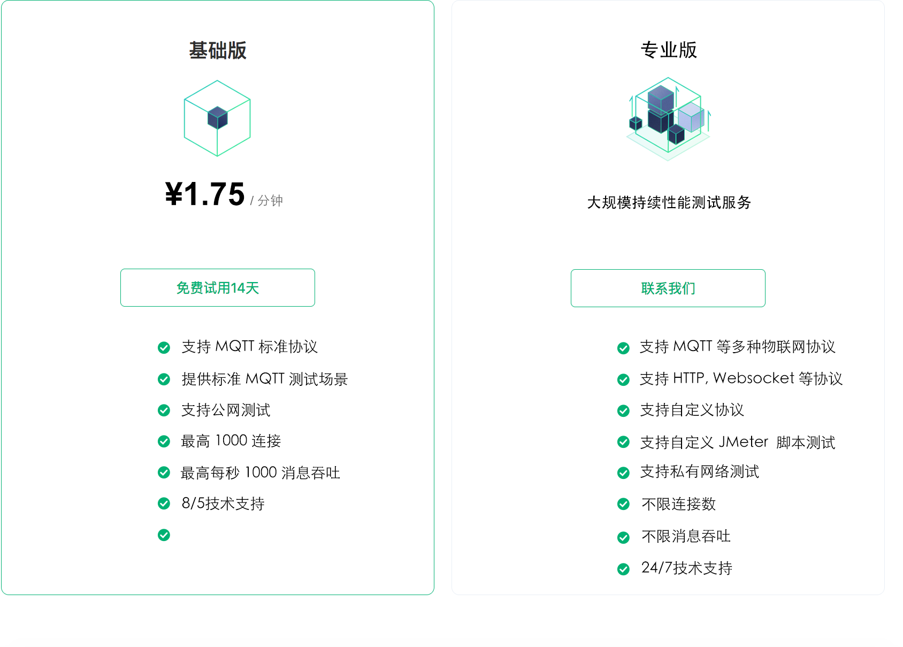

# 产品版本

XMeter Cloud 分为两个版本，每个版本支持不同规格。

1. 基础版：快速体验 XMeter Cloud 测试服务，进行小规格 MQTT 性能测试。基础版提供 14 天免费试用。
2. 专业版：适用于大规模的专业性能测试，丰富的协议支持和测试场景支持，包含自定义脚本、私有网络连接等高级功能。

## 产品定价

<table>
   <tr>
      <th>版本</th>
      <th>规格</th>
      <th>基础费用</th>
      <th>赠送流量</th>
      <th>超出流量单价</th>
   </tr>
   <tr>
      <td rowspan="3">基础版</td>
      <td>1,000 连接 / 最高 1,000 TPS</td>
      <td>¥0.68/小时 起</td>
      <td rowspan="3">100G/月</td>
      <td rowspan="7">￥1.5/GB</td>
   </tr>
   <tr>
      <td>5,000 连接 / 最高 5,000 TPS</td>
      <td>￥1.28/小时 起</td>
   </tr>
   <tr>
      <td>1,0000 连接 / 最高 5,000 TPS</td>
      <td>￥1.68/小时 起</td>
   </tr>
   <tr>
      <td rowspan="5">专业版</td>
      <td>5,000 连接 / 最高 10,000 TPS</td>
      <td>￥2.18/小时 起</td>
      <td rowspan="2">100G/月</td>
   </tr>
   <tr>
      <td>10,000 连接 / 最高 20,000 TPS</td>
      <td>￥3.99/小时 起</td>
   </tr>
   <tr>
      <td>50,000 连接 / 最高 50,000 TPS</td>
      <td>￥10.99/小时 起</td>
      <td rowspan="2">1T/月</td>
   </tr>
   <tr>
      <td>100,000 连接 / 最高 100,000 TPS</td>
      <td>￥19.99/小时 起</td>
   </tr>
   <tr>
      <td>>100,000 连接</td>
      <td>￥19.99/小时 起</td>
      <td colspan="2" align="center">联系商务</td>
   </tr>
   <tr>
      <td>旗舰版</td>
      <td>无限制</td>
      <td colspan="3" align="center">联系商务</td>
   </tr>
</table>

## 功能详情

