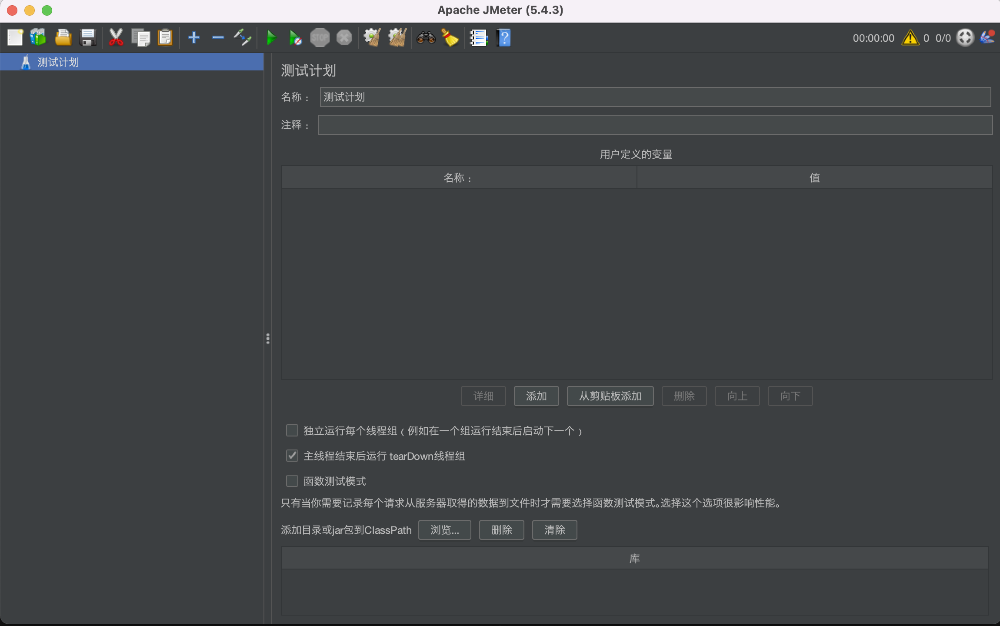
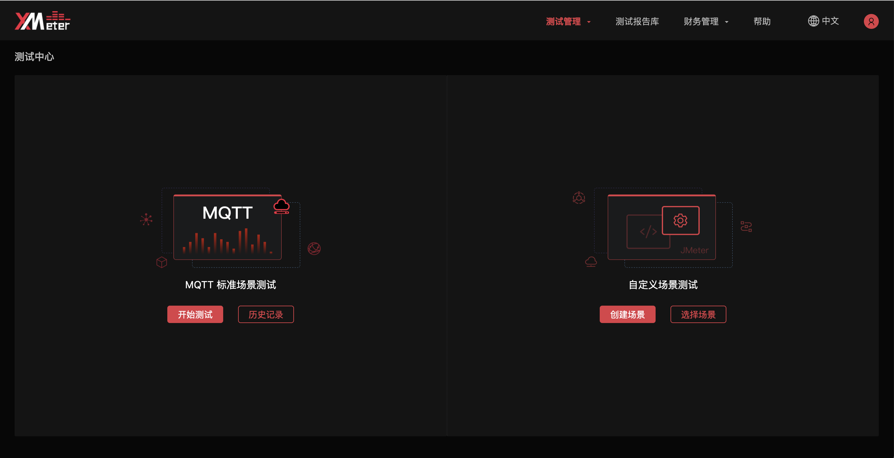
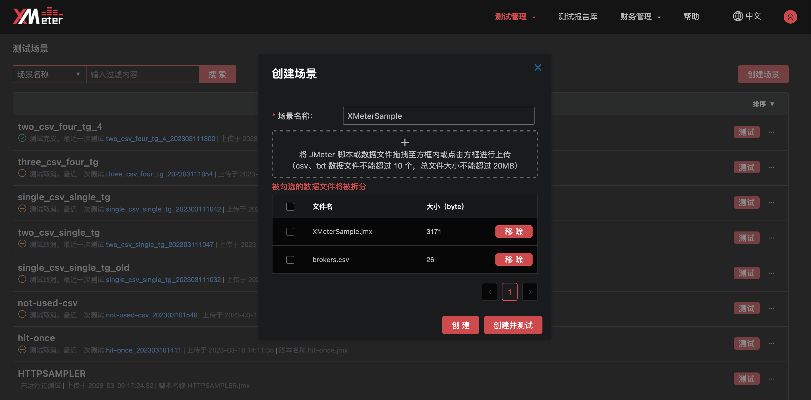
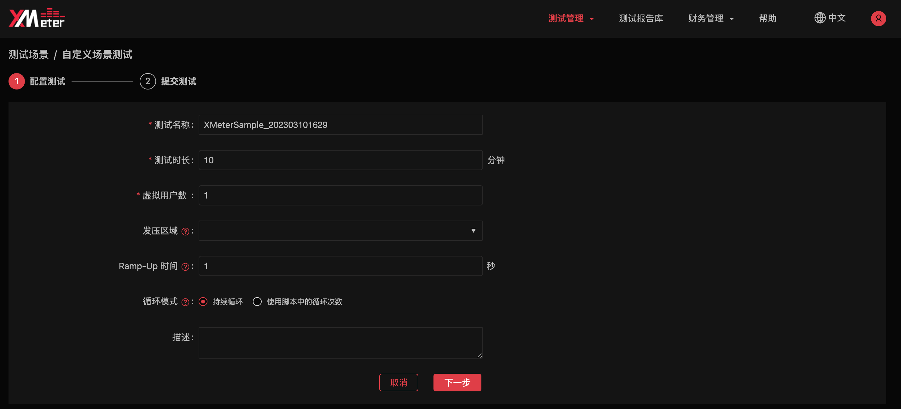
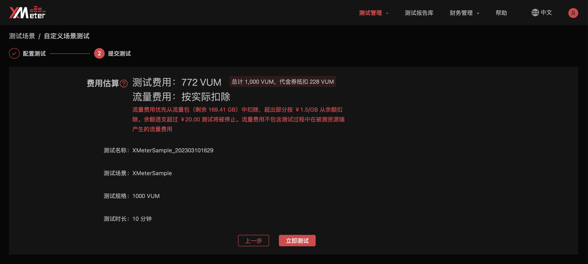

# 提交其他协议测试

XMeter Cloud 基于  [Apache JMeter](https://jmeter.apache.org/) 开源项目，完全兼容 JMeter 测试脚本。如果您正在使用 XMeter Cloud 专业版，可以基于 JMeter 脚本创建自定义场景并发起测试，以测试 MQTT 以外的协议，包括 TCP、HTTP/HTTPS、WebSocket 等。

在本教程中，您将学习如何创建自定义场景发起 MQTT 以外其他协议的测试。

## 创建并发起自定义场景测试

1. 使用 JMeter 设计测试场景，并编写保存脚本。XMeter Cloud 兼容 JMeter 5.0 及以上版本编写的脚本。如果您的 JMeter 脚本中需要使用 CSV 数据文件，请将数据文件存放于 JMeter 脚本的同级目录中进行引用（即 `CSV 数据文件设置` 中的文件名不要包含路径）。

   

2. 登录账户，导航到 XMeter Cloud [控制台](https://xmeter-cloud.emqx.com/commercialPage.html#/)。

3. 在测试中心页面的自定义场景测试处，点击 `创建场景`。

   

4. 将已编辑好的 JMeter 脚本文件（后缀名为 .jmx）上传，并设置场景名称。

   

5. 如果 JMeter 脚本中使用了 CSV 数据文件（后缀名为 .csv 或 .txt），将所使用的数据文件一起上传。

6. 点击 `创建并测试` 按钮，完成自定义场景的创建，并进行测试配置。

   

   - 设置测试名称：为测试设置具有辨识度的名称，与其他测试区分。
   - 设置测试时长：测试的预期运行时间。
   - 虚拟用户数：负载测试中模拟的并发数量。如果脚本中包含多个线程组，需要点击后为每个线程组分别设置。
   - Ramp-Up 时间：指定了测试运行开始后在多长时间内匀速生成所有的虚拟用户。

7. 点击下一步，核对测试配置信息与估算的费用。

   

8. 点击`立即测试`，您将跳转到测试报告页面。测试将在指定测试时长后完成，您将在测试报告页面实时查看到测试的状态与数据，并在测试完成后下载测试报告。您可以前往 [测试报告](../features/test_reports.md)，了解如何解读测试报告。

   