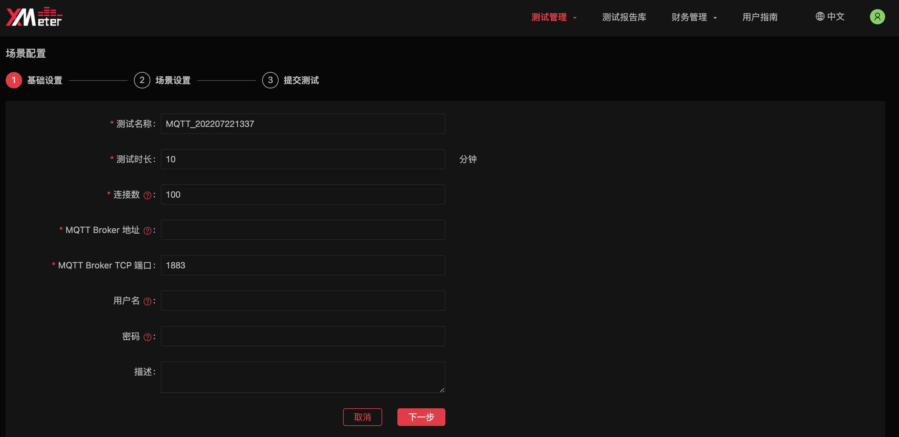
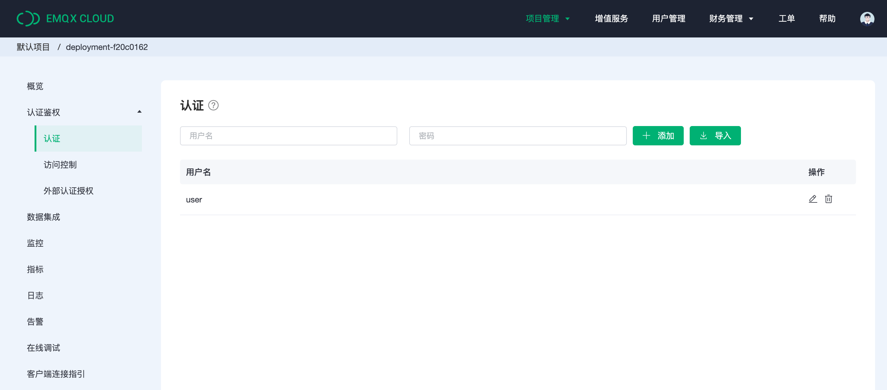

# 创建MQTT 标准场景测试

MQTT是一个基于客户端-服务器的消息发布/订阅传输协议。MQTT最大优点在于，可以以极少的代码和有限的带宽，为连接远程设备提供实时可靠的消息服务。作为一种低开销、低带宽占用的即时通讯协议，使其在物联网、小型设备、移动应用等方面有较广泛的应用。

本文将介绍如何使用XMeter发起MQTT标准场景的测试。

## 开始创建MQTT标标准场景测试

### 1.登录 [XMeter Cloud 控制台](https://accounts.emqx.cn/signin?continue=https://xmeter-cloud.emqx.com/console/)

### 2.进入测试中心页面，点击MQTT 标准场景测试的开始测试

### 3.进行基础设置

- 测试名称：自定义测试名称，方便与其他测试区别。
- 测试时长：运行测试预期时间
- 连接数：连接及消息吞吐测试场景下，连接数包括发布客户端、订阅客户端与 MQTT Broker 的连接数量。
- MQTT Broker 地址：MQTT Broker的公网IP或Host地址

- MQTT Broker TCP 端口：MQTT Broker TCP的端口，测试EMQX Cloud的用户可以进入项目管理下的相应部署页面，点击概览菜单，复制部署的连接地址及端口。

- 用户名：客户端连接 MQTT Broker 时的认证用户名。非必填项。

- 密码：客户端连接 MQTT Broker 时的认证密码。非必填项，测试EMQX Cloud的用户可以进入项目管理下的相应部署页面，点击认证鉴权下的认知，查看对应的用户名，密码

- 描述：用户自定义对测试的描述。

### 4.点击下一步，进行场景设置

1.当选择纯连接测试场景时，代表只针对broker进行连接测试，用户需要输入每秒新建的测试连接数

2.当选择连接及消息吞吐测试场景时，将会有四种模式可供选择

- 上报模式：多个发布客户端向 1 个主题发布消息（发布客户端与基础设置中的连接数相同）
- 1对 1 模式：每个发布客户端发布的消息都由 1 个对应的订阅客户端接收（发布客户端、订阅客户端均占基础设置中的连接数的一半）
- 广播模式：1 个发布客户端在同一个主题上向多个订阅客户端发布消息（订阅客户端与基础设置中的连接数相同，发布消息速率固定为每秒 1 次
- 共享订阅模式：多个发布客户端发布消息，少数订阅客户端以共享订阅方式接收（发布客户端与基础设置中的连接数相同，订阅客户端由用户自定义，但能不超过 10）

3.填写每秒发布消息数，广播模式下，值必须为1

4.选择Qos

- QoS 0：消息最多传递 1 次，如果当时 sub 端不可用，则会丢失该消息。

- QoS 1：消息传递至少 1 次，在 pub 消息之后等待 sub 的 ACK，如果没收到 ACK 则重新发送消息，这种模式能保证消息至少能到达一次，但无法保证消息重复。

- QoS 2：消息仅传送 1 次，QoS 2 设计了重发和重复消息发现机制，保证消息到达对方并且严格只到达一次。因此正常来说这种模式下 sub 端即使离线，在上线后也会收到消息。

  选择Payload，勾选自动生成，表示将由系统自动生成指定长度的字符串 payload。

5.选择Payload

- 勾选自动生成，表示将由系统自动生成指定长度的字符串 payload。
- 选择自定义，表示用户需要输入自定义的Payload内容。

6.点击下一步，查看测试配置内容

7.点击立即提交测试，将跳转到测试报告页面，测试将在指定测试时长时间后，完成测试，用户可以在测试报告页面查看测试情况。点击[测试报告](../features/test_reports.md)，查看测试报告文档.