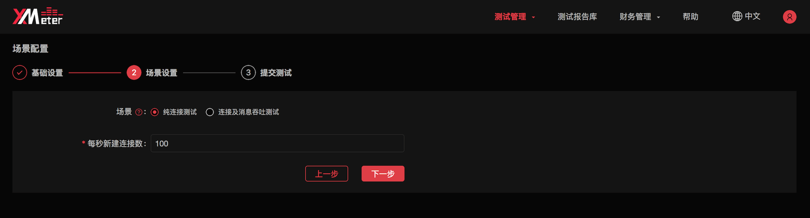

# 提交 MQTT 测试

MQTT 协议占据了物联网协议的半壁江山。在本教程中，您将学习如何使用 XMeter Cloud 内置的 MQTT 测试场景快速发起 MQTT 性能测试。

## 创建并发起 MQTT 标准场景测试

1. 登录账户，导航到 XMeter Cloud [控制台](https://xmeter-cloud.emqx.com/commercialPage.html#/)。

2. 在测试中心页面的 MQTT  标准场景测试处，点击 `开始测试`。

   

3. 进行基础设置

   

   - 设置测试名称：为测试设置具有辨识度的名称，以与其他测试区分。
   - 设置测试时长：测试的预期运行时间。
   - 设置连接数：测试中与 MQTT Broker 建立的连接数量。在带消息吞吐的测试场景下，连接数包括了发布客户端和订阅客户端与 MQTT Broker 的连接。
   - 设置 MQTT Broker 地址及端口：MQTT Broker 的公网 IP 或 Host，以及 TCP 的端口。选择 EMQX Cloud 作为 MQTT Broker 的用户可以从相应部署的概览页面，复制部署的连接地址及端口。

   

   - 设置用户名及密码：客户端连接 MQTT Broker 时的认证用户名和密码。如果 Broker 端未开启认证，不需要填写。选择 EMQX Cloud 作为 MQTT Broker 的用户可以从相应部署的认证鉴权页面，查看对应的用户名和密码。

   

   - 设置描述：为测试提供进一步的说明信息。

4. 进行场景设置

   如果您选择了“纯连接测试”场景，只对 MQTT Broker 进行连接测试，您需要输入每秒新建的连接数。

   

   如果您选择了“连接及消息吞吐测试”场景，将根据不同的模式对发布客户端及订阅客户端进行进一步的设置。

   - 指定模式：您可以从四种模式中选择一种：
      - 上报模式：多个发布客户端向 1 个主题或多个主题发布消息（如果指定上报 Topic，所有消息都发往该主题；如果未指定上报 Topic，每个发布客户端对应 1 个主题）
      - 1 对 1 模式：每个发布客户端发布的消息都由 1 个对应的订阅客户端接收
      - 广播模式：1 个发布客户端在同一个主题上向多个订阅客户端发布消息
      - 共享订阅模式：多个发布客户端发布消息，少数订阅客户端以共享订阅方式接收

   

   - 设置发布客户端与订阅客户端数量。每种不同的模式对应不同的发布客户端及订阅客户端的设置：
      - 上报模式中，只有发布客户端，数量与基础设置中的连接数相同，无需手动设置
      - 1 对 1 模式中，发布客户端、订阅客户端均占基础设置中的连接数的一半，无需手动设置
      - 广播模式中，发布客户端固定为 1 ，订阅客户端与基础设置中的连接数相同，无需手动设置（注：专业版中可调整发布客户端数量）
      - 共享订阅模式中，发布客户端与基础设置中的连接数相同，无需手动设置，您需要指定订阅客户端的数量。
   - 设置每秒发布消息数：您需要依据需求进行设置。测试中消息总吞吐包括发布消息吞吐和订阅消息吞吐，不同的模式下，具体计算方式为：
      - 上报模式中，没有订阅消息，因此消息总吞吐量与每秒发布消息数量相同
      - 1 对 1 模式中，每个发布客户端发布消息的速率与对应订阅客户端接收消息的速率相等，而且发布客户端数量与订阅客户端数量相等，因此发布客户端与订阅客户端的吞吐量也相同，也就是消息总吞吐量等于每秒发布消息数量的2倍
      - 广播模式中，发布消息吞吐量固定为每秒 1 条，所以每个订阅客户端接收到的消息也是每秒 1 条，由于所有订阅客户端的吞吐量之和远大于发布客户端的吞吐量，因此消息总吞吐量计为订阅客户端的总吞吐量，等于订阅客户端数量（注：专业版中可根据需求设置发布消息吞吐量）
      - 共享订阅模式中，将所有发布客户端和所有订阅客户端考虑在内，共享订阅的特点决定了发布消息总吞吐量与接收消息总吞吐量相同，也就是消息总吞吐量等于每秒发布消息数量的2倍
   - 选择 QoS 等级：
      - QoS 0：消息最多送达 1 次。
      - QoS 1：消息传递送达 1 次。
      - QoS 2：消息仅送达 1 次。
   - 设置 Payload：您可以自定义消息内容，也可以指定由系统自动生成指定长度的消息。

5. 核对测试配置信息

   

6. 点击 `立即测试`，您将跳转到测试报告页面。测试将在指定测试时长后完成，您将在测试报告页面实时查看到测试的状态与数据，并在测试完成后下载测试报告。您可以前往 [测试报告](../features/test_reports.md)，了解如何解读测试报告。