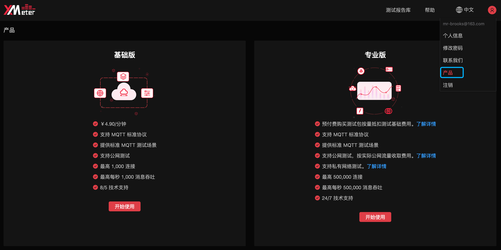
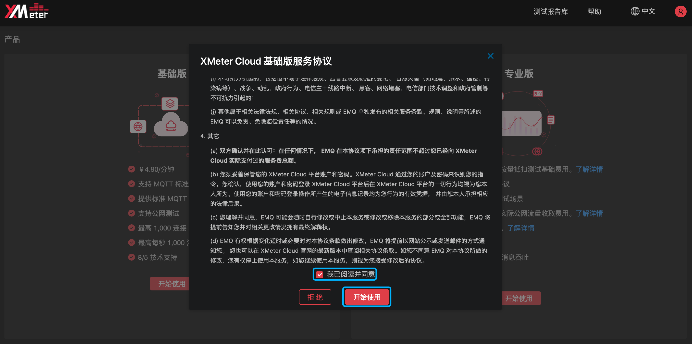
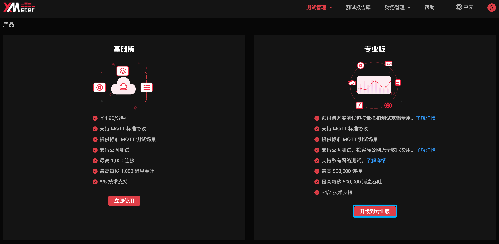
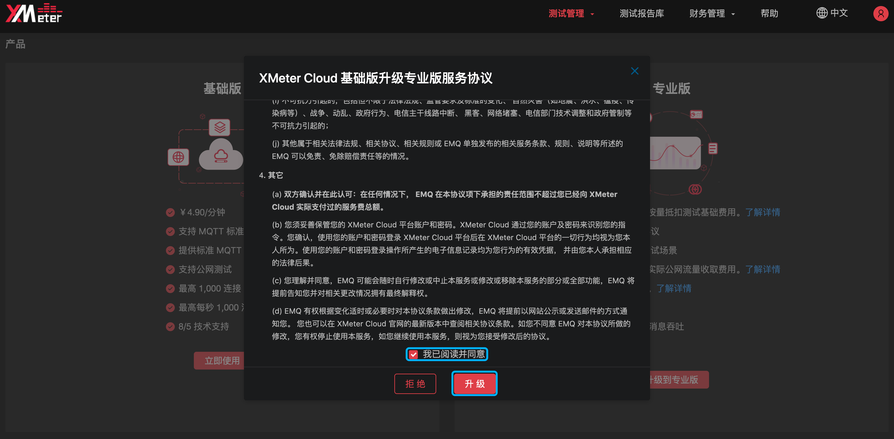
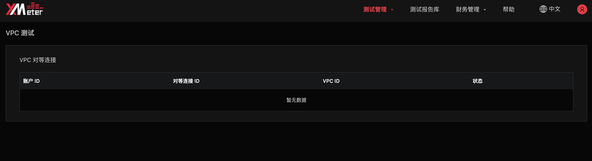
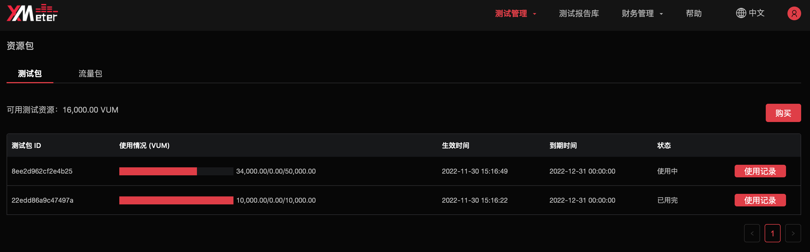

# 选择 XMeter Cloud 产品版本

您在首次使用 XMeter Cloud 时需要选择基础版或专业版作为使用版本。

如果您希望快速体验 XMeter Cloud 测试服务，可以选择基础版尝试小规格 MQTT 负载测试，后续有大规模测试需求时再自助升级到专业版。

您也可以在首次使用时直接选择专业版，体验更丰富的 XMeter Cloud 测试服务。

## 首次使用 XMeter Cloud

1. 选择您需要的产品版本，点击 `开始使用` 按钮。

2. 阅读 XMeter Cloud 服务协议并勾选“我已阅读并同意”，然后点击 `开始使用` 按钮。

## 从基础版升级到专业版

1. 点击顶部菜单中的 `用户图标` -> `产品` ，进入产品页面，点击专业版中的 `升级到专业版` 按钮。

2. 阅读 XMeter Cloud 服务协议并勾选“我已阅读并同意”，然后点击 `升级`按钮。

## 专业版服务

### 更高测试规格

专业版目前支持高至 500,000 连接数，每秒 500,000 消息总吞吐的测试规格。payload 消息体最高可支持 100 KB，并为长稳定性测试提供长达 24 小时的测试时长。

### 更多测试协议支持

除了内置 MQTT 测试场景的支持，专业版还提供自定义场景测试功能，以方便用户以 JMeter 脚本方式创建自定义场景，从而实现 MQTT 以外其他协议的测试，如 TCP、HTTP/HTTPS、WebSocket 等协议。目前兼容 JMeter 5.0 及以上版本内置的多种协议，您也可以联系我们以了解更多的协议支持能力。

### VPC 对等连接

升到到专业版后，您可以通过设置 VPC 对等连接，对私网下的应用和服务进行测试。

### 资源包

资源包分为测试包和流量包：

- 专业版测试过程中产生的测试基础费用由测试包抵扣。
- 专业版中私网测试不产生流量费用，公网测试将产生流量费用，流量费用优先通过流量包抵扣，流量包用尽后从余额中抵扣。

XMeter Cloud 提供多种不同规格和阶梯价格的测试包及流量包，您可根据需要购买。

升级到专业版后，XMeter Cloud 将向您赠送 1GB 的流量包（有效期 3 个月），以方便您对公网测试进行快速验证。

