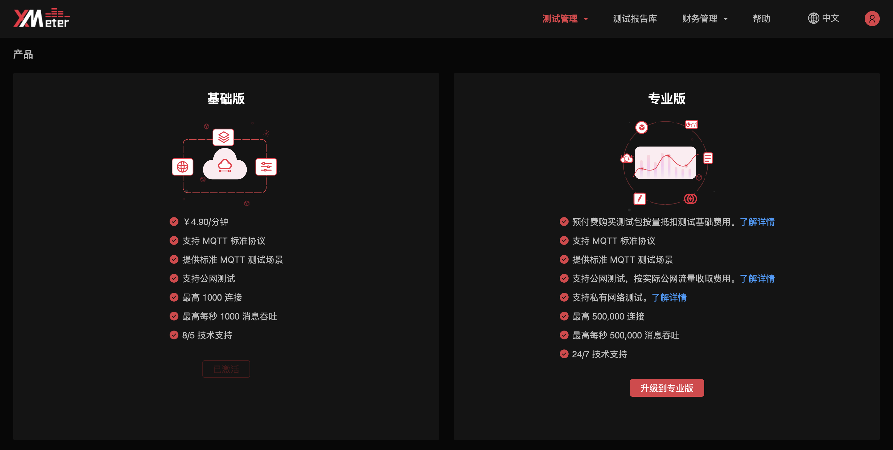
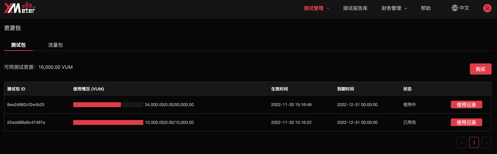

# 升级到专业版

## 如何升级

您可以按以下步骤自助升级到专业版：

从顶部菜单中的 `用户头像` -> `升级` 进入产品页面，点击专业版下方的 `升级到专业版` 按钮，阅读并同意《XMeter Cloud 专业版协议》，即可升级至专业版。升级后您将收到 XMeter Cloud 发送的通知邮件。

您也可以通过以下联系方式，联系我们来协助您进行升级。

* 电话：400-696-5502
* 邮箱：xmeter@emqx.io

## 专业版服务

### 更高测试规格

专业版目前支持高至 500,000 连接数，每秒 500,000 消息总吞吐的测试规格。payload 消息体最高可支持 100 KB，并为长稳定性测试提供长达 24 小时的测试时长。

### VPC 对等连接

升到到专业版后，您可以通过设置 VPC 对等连接，对私网下的应用和服务进行测试。

### 资源包

资源包分为测试包和流量包：

- 专业版测试过程中产生的测试费用由测试包抵扣。
- 专业版中私网测试不产生流量费用，公网测试将产生流量费用，流量费用优先通过流量包抵扣，流量包用尽后从余额中抵扣。

XMeter Cloud 提供多种不同规格和阶梯价格的测试包及流量包，您可根据需要购买。

升级到专业版后，XMeter Cloud 将向您赠送 1GB 的流量包（有效期 3 个月），以方便您对公网测试进行快速验证。

